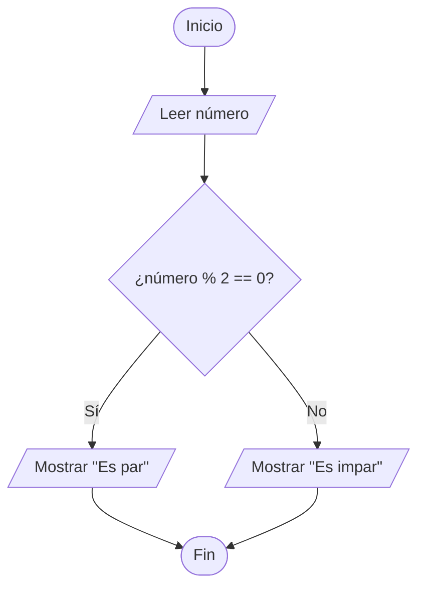
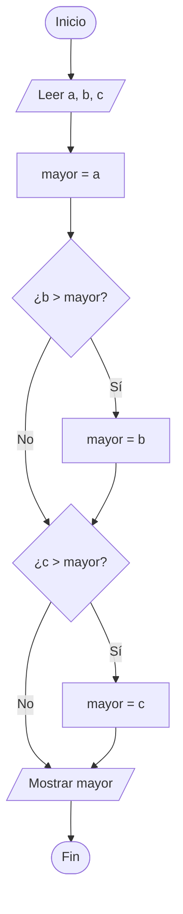
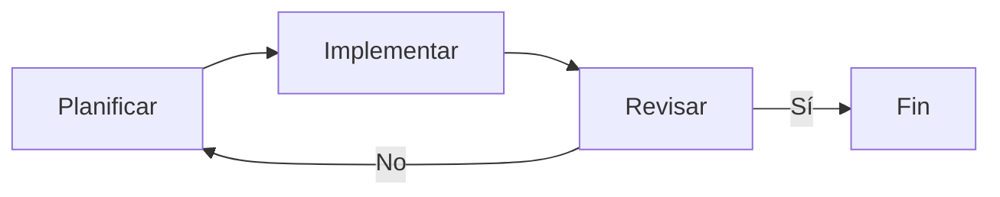

# Cómo Resolver Problemas

## Pensamiento Lógico antes que Código

### Clase de Programación

<div class="mt-6" style="color: #1a2744; font-weight: 600;">
Profesor: Mateo Taito Stambuk
</div>

<div class="mt-2 text-sm" style="color: #8b1a6e;">
Email: <a href="mailto:mateo.taitos@edu.uai.cl" style="color: #8b1a6e; border: none;">mateo.taitos@edu.uai.cl</a>
</div>

<div class="mt-4 text-sm" style="color: #c45200;">
3 de Junio, 2026
</div>

<style>
.slidev-layout h1 {
  color: #1a2744;
}
.slidev-layout h2 {
  color: #2d3e5f;
}
.slidev-layout h3 {
  color: #8b1a6e;
}
strong {
  color: #1a2744;
}
a {
  color: #c45200;
  font-weight: 600;
  text-decoration: none;
  border-bottom: 2px solid #c45200;
  transition: all 0.2s;
}
a:hover {
  color: #8b1a6e;
  border-color: #8b1a6e;
}
</style>

---
layout: center
class: text-center
---
layout: section
---

<div class="section-divider section-orange">
<span class="section-number">0</span>
<h2>Nueva Tarea - Entrega 10/06</h2>
</div>

---

# Nueva Tarea

## Simulador de Banco - Registro de Transacciones

<div class="mt-6 p-6 rounded-lg" style="background: #f5f5f5; border-left: 4px solid #c45200;">

**Enunciado:**

Usted es funcionario de banco. Se maneja un registro histórico de transacciones sobre las cuentas de los clientes.

</div>

<v-clicks>

<div class="mt-6">

### <span class="highlight-blue">Requisitos:</span>

- Simular datos históricos con **6 clientes imaginarios**
- Cada cliente debe tener entre **10 y 20 transacciones aleatorias** (ingresos o egresos)
- Preguntar el **nombre del cliente** y mostrar su **saldo disponible**
- El saldo puede ser **positivo o negativo**

</div>

</v-clicks>

---

# Nueva Tarea

## Ejemplo de ejecución esperada

<div class="mt-6 p-6 rounded-lg" style="background: #f5f5f5; border: 2px solid #8b1a6e;">

```
Ingrese nombre del cliente: Juan Pérez

Transacciones de Juan Pérez:
  Depósito:    +$150.000
  Giro:        -$50.000
  Depósito:    +$80.000
  Transferencia: -$30.000
  ...

Saldo disponible: $250.000
```

</div>

<v-click>

<div class="mt-6 text-center">

<span class="highlight-magenta">Fecha de entrega: 10 de Junio, 2026</span>

</div>

</v-click>

---

# Objetivos de la Clase

<div class="text-left mt-8 space-y-4">

- <span class="highlight-magenta">Comprender</span> la importancia del pensamiento lógico
- <span class="highlight-magenta">Aprender</span> a leer y separar un problema en partes
- <span class="highlight-magenta">Utilizar</span> diagramas de flujo como herramienta de planificación
- <span class="highlight-magenta">Practicar</span> el ciclo: planificar, implementar, revisar

</div>

<style>
.highlight-magenta {
  color: #8b1a6e;
  font-weight: 700;
}
.highlight-orange {
  color: #c45200;
  font-weight: 700;
}
.highlight-blue {
  color: #1a2744;
  font-weight: 700;
}
</style>

---
layout: section
---

<div class="section-divider">
<span class="section-number">1</span>
<h2>El Problema del Día</h2>
</div>

<style>
.section-divider {
  display: flex;
  align-items: center;
  gap: 1.5rem;
  justify-content: center;
  padding: 3rem 0;
}
.section-number {
  display: flex;
  align-items: center;
  justify-content: center;
  width: 80px;
  height: 80px;
  border-radius: 50%;
  background: #1a2744;
  color: white;
  font-size: 2.5rem;
  font-weight: 800;
}
.section-divider h2 {
  color: #1a2744;
  font-size: 2.5rem;
  margin: 0;
}
</style>

---

# El Problema

## Encontrar el Mayor de Tres Números

<div class="mt-6 p-6 rounded-lg" style="background: #f5f5f5; border-left: 4px solid #c45200;">

**Enunciado:**

Dado tres números ingresados por el usuario, determinar cuál es el mayor y mostrarlo en pantalla.

</div>

<v-click>

<div class="mt-6">

**Pregunta clave:** ¿Cómo lo resolvemos?

- ¿Escribimos código directamente?
- ¿O pensamos primero?

</div>

</v-click>

---
layout: section
---

<div class="section-divider section-magenta">
<span class="section-number">2</span>
<h2>Lógica vs Código</h2>
</div>

<style>
.section-magenta .section-number {
  background: #8b1a6e;
}
.section-magenta h2 {
  color: #8b1a6e;
}
</style>

---

# Lógica vs Codificación

## Dos habilidades diferentes

<div class="grid grid-cols-2 gap-8 mt-8">

<div class="p-6 rounded-lg" style="background: #e8f0e8; border: 2px solid #1a2744;">

### <span class="highlight-blue">Lógica</span>

- ¿Qué necesito resolver?
- ¿Qué pasos debo seguir?
- ¿En qué orden?
- **Se piensa, no se escribe**

</div>

<div class="p-6 rounded-lg" style="background: #ffe8e0; border: 2px solid #c45200;">

### <span class="highlight-orange">Codificación</span>

- Traducir la lógica a código
- Usar la sintaxis correcta
- Manejar detalles técnicos
- **Se escribe después de pensar**

</div>

</div>

<v-click>

<div class="mt-8 text-center">

<span class="highlight-magenta">Primero la lógica, después el código</span>

</div>

</v-click>

---

# ¿Por qué pensar antes de escribir?

<v-clicks>

- <span class="highlight-blue">Evita errores lógicos:</span> el código puede compilar pero dar resultados incorrectos
- <span class="highlight-magenta">Ahorra tiempo:</span> es más fácil corregir un plan que reescribir código
- <span class="highlight-orange">Mejora la claridad:</span> sabes exactamente qué hace cada parte
- <span class="highlight-blue">Facilita la comunicación:</span> puedes explicar tu solución a otros

</v-clicks>

<v-click>

<div class="mt-8 p-4 rounded-lg text-center" style="background: #f5f5f5; border: 2px solid #8b1a6e;">

**Analogía:** No construyes una casa sin un plano. Tampoco debes escribir código sin un plan.

</div>

</v-click>

---
layout: section
---

<div class="section-divider section-orange">
<span class="section-number">3</span>
<h2>Diagramas de Flujo</h2>
</div>

<style>
.section-orange .section-number {
  background: #c45200;
}
.section-orange h2 {
  color: #c45200;
}
</style>

---

# Diagramas de Flujo

## Herramienta de planificación visual

<div class="grid grid-cols-2 gap-8 mt-6">

<div>

**¿Qué es?**

Un diagrama que muestra los pasos de un proceso usando figuras geométricas.

<v-click>

**¿Para qué sirve?**

- Visualizar el flujo lógico
- Identificar decisiones y caminos
- Comunicar la solución a otros

</v-click>

</div>

<div>

<v-click>

**Figuras básicas:**

| Figura | Significado |
|--------|-------------|
| Óvalo | Inicio / Fin |
| Rectángulo | Proceso / Acción |
| Rombo | Decisión (Sí/No) |
| Paralelogramo | Entrada / Salida |

</v-click>

</div>

</div>

---

# Ejemplo de Diagrama

## Flujo simple: ¿Es par o impar?


<div style="transform: scale(0.7); transform-origin: top right;">



</div>

<v-click>

<div class="mt-4 text-center">

<span class="highlight-magenta">El diagrama se entiende sin saber programación</span>

</div>

</v-click>

---
layout: section
---

<div class="section-divider">
<span class="section-number">4</span>
<h2>Estructura Típica</h2>
</div>

---

# Estructura de Resolución

## Tres bloques fundamentales

<div class="grid grid-cols-3 gap-6 mt-8">

<div class="p-6 rounded-lg text-center" style="background: #e8f0e8; border: 2px solid #1a2744;">

### <span class="highlight-blue">1. Inicialización</span>

Definir variables y valores iniciales

<div class="mt-4 text-sm">

```
a = 0
b = 0
c = 0
mayor = 0
```

</div>

</div>

<div class="p-6 rounded-lg text-center" style="background: #f5e6f5; border: 2px solid #8b1a6e;">

### <span class="highlight-magenta">2. Lógica</span>

Procesar datos y tomar decisiones

<div class="mt-4 text-sm">

```
Si a > b y a > c:
    mayor = a
Sino si b > c:
    mayor = b
Sino:
    mayor = c
```

</div>

</div>

<div class="p-6 rounded-lg text-center" style="background: #ffe8e0; border: 2px solid #c45200;">

### <span class="highlight-orange">3. Salidas</span>

Mostrar resultados al usuario

<div class="mt-4 text-sm">

```
Mostrar "El mayor es: "
Mostrar mayor
```

</div>

</div>

</div>

<v-click>

<div class="mt-6 text-center">

<span class="highlight-blue">Esta estructura aplica a la mayoría de los problemas simples</span>

</div>

</v-click>

---
layout: section
---

<div class="section-divider section-magenta">
<span class="section-number">5</span>
<h2>Leer el Problema</h2>
</div>

---

# Cómo Leer un Problema

## Separar en partes

<div class="mt-6 p-6 rounded-lg" style="background: #f5f5f5; border-left: 4px solid #c45200;">

**Problema:** Dado tres números ingresados por el usuario, determinar cuál es el mayor y mostrarlo en pantalla.

</div>

<v-clicks>

<div class="mt-6">

### <span class="highlight-blue">1. Variables</span> (¿Qué datos tengo?)

- Tres números: `a`, `b`, `c`
- Un resultado: `mayor`

</div>

</v-clicks>

---

# Cómo Leer un Problema

## Separar en partes (continuación)

<v-clicks>

<div class="mt-4">

### <span class="highlight-magenta">2. Lógica</span> (¿Qué debo hacer?)

- Comparar los tres números
- Encontrar cuál es el mayor

</div>

<div class="mt-4">

### <span class="highlight-orange">3. Resultados esperados</span> (¿Qué debo mostrar?)

- El número mayor

</div>

</v-clicks>

---
layout: section
---

<div class="section-divider section-orange">
<span class="section-number">6</span>
<h2>Diagrama de Flujo</h2>
</div>

---

# Diagrama de Flujo

## Solución al problema del mayor

<div style="transform: scale(0.5); transform-origin: top right; position: absolute; right: 10rem; top: 0rem;">



</div>

<v-click>

<div class="mt-4 text-center">

<span class="highlight-magenta">Lógica clara antes de escribir código</span>

</div>

</v-click>

---
layout: section
---

<div class="section-divider">
<span class="section-number">7</span>
<h2>Llevar a Código</h2>
</div>

---

# De Diagrama a Código

## Paso a paso

```python {all|1-2|4-5|7-12|14|1-14}
# 1. Inicialización
a = int(input("Ingrese primer número: "))
b = int(input("Ingrese segundo número: "))
c = int(input("Ingrese tercer número: "))

# 2. Lógica
mayor = a
if b > mayor:
    mayor = b
if c > mayor:
    mayor = c

# 3. Salida
print(f"El mayor es: {mayor}")
```

<v-clicks>

- <span class="highlight-blue">Línea 1-2:</span> Inicializamos las variables de entrada
- <span class="highlight-magenta">Línea 4-5:</span> Asumimos que `a` es el mayor
- <span class="highlight-orange">Línea 7-12:</span> Comparamos con `b` y `c`, actualizando si encontramos uno mayor
- <span class="highlight-blue">Línea 14:</span> Mostramos el resultado

</v-clicks>

---

# Comparación: Diagrama vs Código

<div class="grid grid-cols-2 gap-8 mt-6">

<div>

**Diagrama:**

<div style="transform: scale(0.3); transform-origin: top right; position: absolute; left: 2rem; top: 10rem;">


</div>
</div>

<div>

**Código:**

```python
a = int(input("Número 1: "))
b = int(input("Número 2: "))
c = int(input("Número 3: "))

mayor = a
if b > mayor:
    mayor = b
if c > mayor:
    mayor = c

print(f"Mayor: {mayor}")
```

</div>

</div>

<v-click>

<div class="mt-4 text-center">

<span class="highlight-magenta">El código es una traducción directa del diagrama</span>

</div>

</v-click>

---
layout: section
---

<div class="section-divider section-magenta">
<span class="section-number">8</span>
<h2>Revisar la Solución</h2>
</div>

---

# Revisar la Solución

## Debugging manual: seguir las variables

<div class="mt-4 p-4 rounded-lg" style="background: #f5f5f5; border: 2px solid #1a2744;">

**Caso de prueba:** a = 5, b = 3, c = 8

</div>

<v-clicks>

| Paso | Código ejecutado | Estado de variables |
|------|------------------|---------------------|
| 1 | `a = 5, b = 3, c = 8` | a=5, b=3, c=8 |
| 2 | `mayor = a` | mayor=5 |
| 3 | `¿b > mayor?` → `¿3 > 5?` | No, no cambia |
| 4 | `¿c > mayor?` → `¿8 > 5?` | Sí, actualiza |
| 5 | `mayor = c` | mayor=8 |
| 6 | `print(mayor)` | Muestra: 8 |

</v-clicks>

<v-click>

<div class="mt-4 text-center">

<span class="highlight-orange">¿El resultado es correcto? Sí, 8 es el mayor de 5, 3, 8</span>

</div>

</v-click>

---

# Otro Caso de Prueba

## Verificar restricciones

<div class="mt-4 p-4 rounded-lg" style="background: #f5f5f5; border: 2px solid #8b1a6e;">

**Caso con números iguales:** a = 5, b = 5, c = 5

</div>

<v-clicks>

| Paso | Código ejecutado | Estado de variables |
|------|------------------|---------------------|
| 1 | `a = 5, b = 5, c = 5` | a=5, b=5, c=5 |
| 2 | `mayor = a` | mayor=5 |
| 3 | `¿b > mayor?` → `¿5 > 5?` | No (no es mayor) |
| 4 | `¿c > mayor?` → `¿5 > 5?` | No (no es mayor) |
| 5 | `print(mayor)` | Muestra: 5 |

</v-clicks>

<v-click>

<div class="mt-4 text-center">

<span class="highlight-magenta">Correcto: si todos son iguales, cualquiera es el mayor</span>

</div>

</v-click>

---
layout: section
---

<div class="section-divider section-orange">
<span class="section-number">9</span>
<h2>El Ciclo Completo</h2>
</div>

---

# Ciclo de Resolución

## Planificar → Implementar → Revisar

<div style="transform: scale(0.7); transform-origin: top left;">



</div>

<v-clicks>

<div class="mt-6">

### <span class="highlight-blue">Planificar</span>
- Leer el problema completo
- Identificar variables, lógica, salidas, restricciones
- Dibujar diagrama de flujo

</div>

<div class="mt-4">

### <span class="highlight-magenta">Implementar</span>
- Traducir el diagrama a código
- Seguir la estructura: Inicialización → Lógica → Salidas

</div>

<div class="mt-4">

### <span class="highlight-orange">Revisar</span>
- Probar con casos de prueba
- Verificar que el resultado sea correcto
- Si hay errores, volver a planificar

</div>

</v-clicks>

---
layout: section
---

<div class="section-divider">
<span class="section-number">10</span>
<h2>Lo que Aprendimos</h2>
</div>

---

# Resumen

## Conceptos clave de la clase

<v-clicks>

- <span class="highlight-blue">Pensar antes de escribir:</span> la lógica va antes que el código
- <span class="highlight-magenta">Separar el problema:</span> variables, lógica, salidas, restricciones
- <span class="highlight-orange">Diagramas de flujo:</span> herramienta visual para planificar
- <span class="highlight-blue">Estructura básica:</span> inicialización → lógica → salidas
- <span class="highlight-magenta">Revisar la solución:</span> probar con casos de prueba manualmente
- <span class="highlight-orange">Ciclo completo:</span> planificar → implementar → revisar

</v-clicks>

<v-click>

<div class="mt-8 p-4 rounded-lg text-center" style="background: #f5f5f5; border: 2px solid #1a2744;">

**Regla de oro:** Un buen programador piensa más de lo que escribe.

</div>

</v-click>

---
layout: section
---

<div class="section-divider section-magenta">
<span class="section-number">11</span>
<h2>Desafío</h2>
</div>

---

# Desafío (15 minutos)

## Suma de Matrices 3x3

<div class="mt-6 p-6 rounded-lg" style="background: #f5f5f5; border-left: 4px solid #c45200;">

**Problema:**

Dadas dos matrices de 3x3 ingresadas por el usuario (usando listas anidadas y ciclos `for`), calcular la suma de ambas matrices y mostrar el resultado.

**Ejemplo:**

```
Matriz A:    Matriz B:    Resultado:
1  2  3     4  5  6     5   7   9
4  5  6     7  8  9     11  13  15
7  8  9     1  2  3     8   10  12
```

</div>

<v-click>

<div class="mt-6">

**Pasos sugeridos:**

1. <span class="highlight-blue">Planificar:</span> Identificar variables, lógica, salidas
2. <span class="highlight-magenta">Diagrama:</span> Dibujar el flujo del programa
3. <span class="highlight-orange">Implementar:</span> Escribir el código
4. <span class="highlight-blue">Revisar:</span> Probar con el ejemplo

</div>

</v-click>

---
layout: center
class: text-center
---

<div class="thank-you">
<h1>¡Gracias!</h1>
<h2>¿Preguntas?</h2>
</div>

<div class="mt-8 text-sm" style="color: #888;">
Cómo Resolver Problemas: Pensamiento Lógico
</div>

<style>
.thank-you h1 {
  font-size: 4rem;
  color: #1a2744;
  margin-bottom: 1rem;
}
.thank-you h2 {
  font-size: 2rem;
  color: #c45200;
  font-weight: 400;
}
</style>
