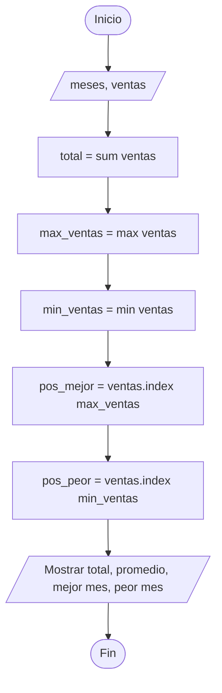
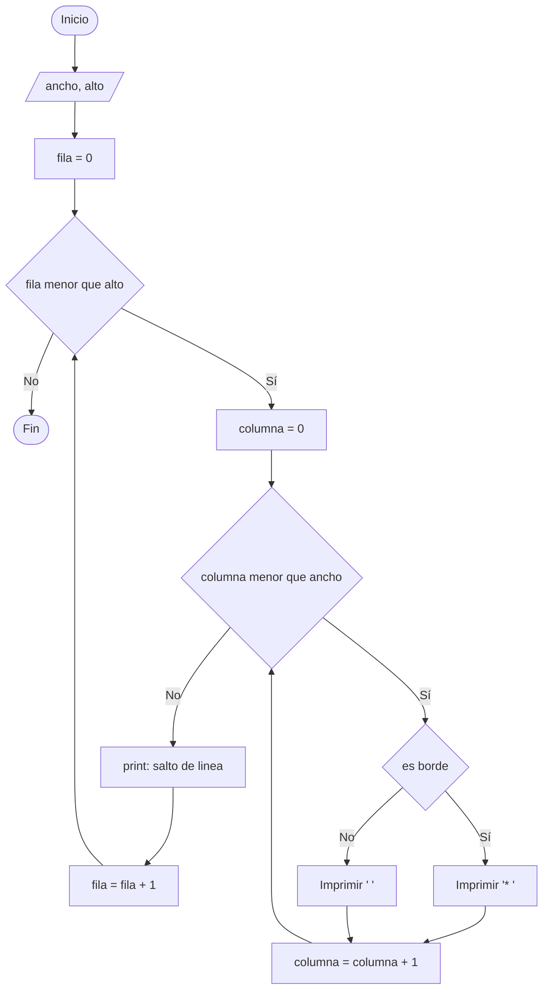
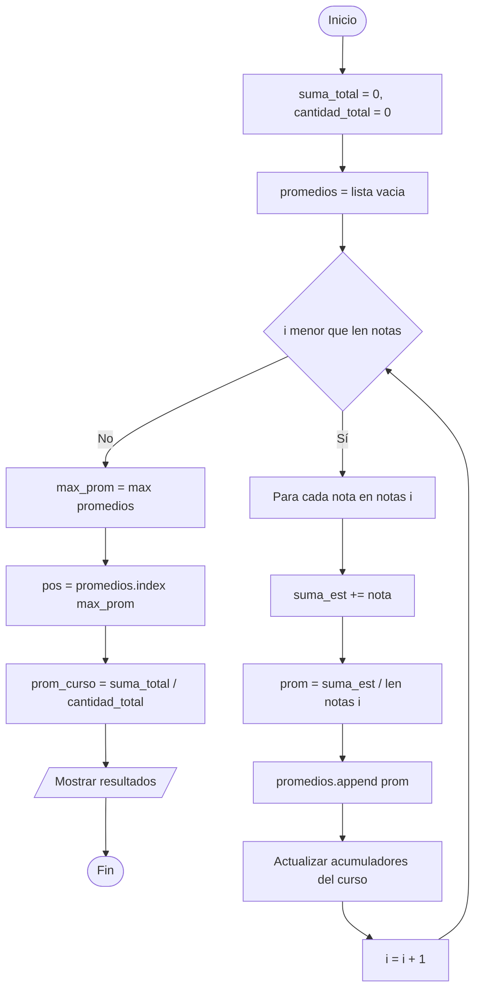

# Clase de Ejercicios

## Listas, Índices y Ciclos

### Clase de Programación

<div class="mt-6" style="color: #1a2744; font-weight: 600;">
Profesor: Mateo Taito Stambuk
</div>

<div class="mt-2 text-sm" style="color: #8b1a6e;">
Email: <a href="mailto:mateo.taitos@edu.uai.cl" style="color: #8b1a6e; border: none;">mateo.taitos@edu.uai.cl</a>
</div>

<div class="mt-4 text-sm" style="color: #c45200;">
5 de Junio, 2026
</div>

<style>
.slidev-layout h1 {
  color: #1a2744;
}
.slidev-layout h2 {
  color: #2d3e5f;
}
.slidev-layout h3 {
  color: #8b1a6e;
}
strong {
  color: #1a2744;
}
a {
  color: #c45200;
  font-weight: 600;
  text-decoration: none;
  border-bottom: 2px solid #c45200;
  transition: all 0.2s;
}
a:hover {
  color: #8b1a6e;
  border-color: #8b1a6e;
}
</style>

---

# Objetivos de la Clase

<div class="text-left mt-8 space-y-4">

- <span class="highlight-magenta">Aplicar</span> la metodología de resolución vista el 03/06
- <span class="highlight-magenta">Practicar</span> el uso de `.index()` sobre listas paralelas
- <span class="highlight-magenta">Imprimir</span> figuras en pantalla usando ciclos anidados
- <span class="highlight-magenta">Trabajar</span> con listas 2D de largo irregular

</div>

<style>
.highlight-magenta {
  color: #8b1a6e;
  font-weight: 700;
}
.highlight-orange {
  color: #c45200;
  font-weight: 700;
}
.highlight-blue {
  color: #1a2744;
  font-weight: 700;
}
</style>

---

# Recordatorio: Metodología 03/06

## Planificar → Diagrama → Implementar → Revisar

<div class="grid grid-cols-2 gap-5 mt-4">

<div class="p-4 rounded-lg" style="background: #e8f0e8; border-left: 4px solid #1a2744;">

### <span class="highlight-blue">1. Planificar</span>

- Leer el problema completo
- Identificar **variables**
- Definir la **lógica**
- Pensar las **salidas**
- Anotar **restricciones**

</div>

<div class="p-4 rounded-lg" style="background: #f5e6f5; border-left: 4px solid #8b1a6e;">

### <span class="highlight-magenta">2. Diagrama de Flujo</span>

- Visualizar el flujo lógico
- Decidir: ¿ciclo? ¿condición?
- Marcar entradas y salidas

</div>

<div class="p-4 rounded-lg" style="background: #ffe8e0; border-left: 4px solid #c45200;">

### <span class="highlight-orange">3. Implementar</span>

- Traducir el diagrama a código
- Seguir la estructura: **inicialización → lógica → salidas**

</div>

<div class="p-4 rounded-lg" style="background: #f5f5f5; border-left: 4px solid #1a2744;">

### <span class="highlight-blue">4. Revisar</span>

- Probar con casos de prueba
- Verificar que el resultado sea correcto
- Si falla, **volver al paso 1**

</div>

</div>

<v-click>

<div class="mt-4 text-center">

<span class="highlight-magenta">Hoy aplicaremos estos 4 pasos en 3 ejercicios diferentes</span>

</div>

</v-click>

---
layout: section
---

<div class="section-divider">
<span class="section-number">1</span>
<h2>Listas Paralelas con .index()</h2>
</div>

<style>
.section-divider {
  display: flex;
  align-items: center;
  gap: 1.5rem;
  justify-content: center;
  padding: 3rem 0;
}
.section-number {
  display: flex;
  align-items: center;
  justify-content: center;
  width: 80px;
  height: 80px;
  border-radius: 50%;
  background: #1a2744;
  color: white;
  font-size: 2.5rem;
  font-weight: 800;
}
.section-divider h2 {
  color: #1a2744;
  font-size: 2.5rem;
  margin: 0;
}
</style>

---

# Ejercicio 1: Análisis de Ventas Mensuales

## Enunciado del Problema

Una tienda registra las ventas de cada mes del año. Tenemos dos listas paralelas:

- Una lista con los **12 meses** del año.
- Una lista con las **ventas** correspondientes (mismo orden).

<span class="highlight-magenta">Misión:</span> A partir de los datos, calcular y mostrar:

<v-clicks>

1. El **total** de ventas del año.
2. El **promedio mensual** de ventas.
3. El **mejor mes** (nombre + cantidad de ventas).
4. El **peor mes** (nombre + cantidad de ventas).

</v-clicks>

---

# Ejercicio 1: Planteamiento

## Planificar: Variables, Lógica, Salidas

<div class="grid grid-cols-2 gap-5 mt-4">

<div>

### <span class="highlight-blue">Variables</span>

- `meses`: lista de strings (12 elementos)
- `ventas`: lista de números (12 elementos)
- `total`: acumulador de ventas
- `promedio`: total / 12
- `max_ventas`, `min_ventas`: valores extremos
- `pos_mejor`, `pos_peor`: posiciones

</div>

<div>

### <span class="highlight-orange">Lógica</span>

- Calcular `total` con `sum(ventas)`
- `promedio = total / len(ventas)`
- Usar `max(ventas)` y `min(ventas)` para extremos
- Usar `.index()` para ubicar la posición
- Conectar con `meses[pos]` para el nombre

</div>

</div>

<v-click>

<div class="mt-3 p-3 rounded-lg" style="background: #f5f5f5; border-left: 4px solid #8b1a6e;">

### <span class="highlight-magenta">Salidas esperadas</span>

```
Total de ventas del año: 2050
Promedio mensual: 170.83 ventas
Mejor mes: Diciembre (220 ventas)
Peor mes: Enero (120 ventas)
```

</div>

</v-click>

---

# Ejercicio 1: Diagrama de Flujo

<div class="diagram-container">



</div>

<style>
.diagram-container {
  display: flex;
  justify-content: center;
  transform: scale(0.55);
  transform-origin: top center;
  margin-top: -1rem;
  margin-bottom: -12rem;
}
</style>

---

# Ejercicio 1: Código Completo

```python {all|1-3|5-6|8-9|11-12|14-17|1-17}
# 1. Inicialización: datos del problema
meses = ["Enero", "Febrero", "Marzo", "Abril", "Mayo", "Junio",
         "Julio", "Agosto", "Septiembre", "Octubre", "Noviembre", "Diciembre"]
ventas = [120, 145, 160, 130, 175, 200, 210, 195, 180, 165, 150, 220]

# 2. Lógica: cálculos y búsquedas
total = sum(ventas)
promedio = total / len(ventas)
max_ventas = max(ventas)
min_ventas = min(ventas)
pos_mejor = ventas.index(max_ventas)
pos_peor = ventas.index(min_ventas)

# 3. Salidas: mostrar los resultados
print(f"Total de ventas del año: {total}")
print(f"Promedio mensual: {promedio:.2f} ventas")
print(f"Mejor mes: {meses[pos_mejor]} ({max_ventas} ventas)")
print(f"Peor mes: {meses[pos_peor]} ({min_ventas} ventas)")
```

---

# Ejercicio 1: Explicación Detallada

<v-clicks>

- <span class="highlight-blue">Líneas 1-3:</span> Definimos las dos listas paralelas: `meses` (strings) y `ventas` (números). Ambas tienen **12 elementos** en el mismo orden.
- <span class="highlight-orange">Línea 6:</span> `sum(ventas)` recorre la lista y acumula el total. Equivale a un `for` con un acumulador.
- <span class="highlight-orange">Línea 7:</span> `len(ventas)` devuelve 12. Dividir el total por la cantidad da el **promedio mensual**.
- <span class="highlight-magenta">Líneas 8-9:</span> `max(ventas)` y `min(ventas)` devuelven el valor mayor y menor de la lista.
- <span class="highlight-blue">Líneas 10-11:</span> <span class="highlight-magenta">Aquí está la clave:</span> `.index(valor)` recorre la lista y devuelve la **posición** donde aparece ese valor.
  - `ventas.index(220)` → `11` (porque 220 está en la posición 11)
- <span class="highlight-blue">Línea 14:</span> Combinamos `meses[11]` → `"Diciembre"` con el valor `220`.
- <span class="highlight-blue">Línea 15:</span> Mismo proceso para el peor mes, usando `pos_peor` en lugar de `pos_mejor`.

</v-clicks>

---

# Ejercicio 1: Revisar

## Caso de prueba: seguimiento paso a paso

<div class="mt-3 p-3 rounded-lg" style="background: #f5f5f5; border: 2px solid #1a2744;">

**Datos:** `ventas = [120, 145, 160, 130, 175, 200, 210, 195, 180, 165, 150, 220]`

</div>

<v-clicks>

| Paso | Operación | Resultado |
|------|-----------|-----------|
| 1 | `total = sum(ventas)` | `2050` |
| 2 | `promedio = 2050 / 12` | `170.83` |
| 3 | `max_ventas = max(ventas)` | `220` |
| 4 | `min_ventas = min(ventas)` | `120` |
| 5 | `pos_mejor = ventas.index(220)` | `11` |
| 6 | `pos_peor = ventas.index(120)` | `0` |
| 7 | `meses[11]` | `"Diciembre"` |
| 8 | `meses[0]` | `"Enero"` |

</v-clicks>

<v-click>

<div class="mt-3 text-center">

<span class="highlight-orange">¿Correcto? Sí: el mes 11 es Diciembre (220 ventas) y el mes 0 es Enero (120 ventas)</span>

</div>

</v-click>

---
layout: section
---

<div class="section-divider section-magenta">
<span class="section-number">2</span>
<h2>Impresión de Figuras</h2>
</div>

<style>
.section-magenta .section-number {
  background: #8b1a6e;
}
.section-magenta h2 {
  color: #8b1a6e;
}
</style>

---

# Ejercicio 2: Marco Rectangular

## Enunciado del Problema

Se pide crear un programa que dibuje un **marco rectangular** en la pantalla usando el carácter asterisco (`*`).

El usuario ingresa (o se definen en código) el **ancho** y el **alto**.

Si `ancho = 8` y `alto = 5`, se debe ver así:

```text
* * * * * * * *
*             *
*             *
*             *
* * * * * * * *
```

<v-click>

- El **borde** está hecho de asteriscos.
- El **interior** está hecho de espacios en blanco.

</v-click>

---

# Ejercicio 2: Planteamiento

## Planificar: Variables, Lógica, Salidas

<div class="grid grid-cols-2 gap-5 mt-4">

<div>

### <span class="highlight-blue">Variables</span>

- `ancho`: número de columnas (W)
- `alto`: número de filas (H)
- `fila`: contador del ciclo externo
- `columna`: contador del ciclo interno

</div>

<div>

### <span class="highlight-orange">Lógica</span>

Para cada celda `(fila, columna)`, decidir qué imprimir:

- **Borde:** `fila == 0` o `fila == alto - 1` o `columna == 0` o `columna == ancho - 1` → `"* "`
- **Interior:** en cualquier otro caso → `"  "` (dos espacios)

</div>

</div>

<v-click>

<div class="mt-3 p-3 rounded-lg" style="background: #f5f5f5; border-left: 4px solid #c45200;">

### <span class="highlight-orange">Truco visual</span>

Cada `*` se imprime seguido de un espacio (`"* "`), y los espacios del interior son **dos** espacios (`"  "`), para mantener el alineamiento cuadrado.

</div>

</v-click>

---

# Ejercicio 2: Diagrama de Flujo

<div class="diagram-container">



</div>

<style>
.diagram-container {
  display: flex;
  justify-content: center;
  transform: scale(0.7);
  transform-origin: top center;
  margin-top: -1rem;
}
</style>

<v-click>

<div class="mt-2 text-center">

<span class="highlight-magenta">Estructura clásica: ciclo externo (filas) + ciclo interno (columnas)</span>

</div>

</v-click>

---

# Ejercicio 2: Código Completo

```python {all|1-2|4-6|8-11|13|1-13}
# 1. Inicialización: dimensiones del marco
ancho = 8
alto = 5

# 2. Lógica: recorrer filas y columnas
for fila in range(alto):
    for columna in range(ancho):
        es_borde = (fila == 0) or (fila == alto - 1) or (columna == 0) or (columna == ancho - 1)
        if es_borde:
            print("* ", end="")
        else:
            print("  ", end="")
    # 3. Salida: terminar la fila
    print()
```

---

# Ejercicio 2: Explicación Detallada

<v-clicks>

- <span class="highlight-blue">Líneas 1-2:</span> Definimos las dimensiones del rectángulo: 8 columnas de ancho y 5 filas de alto.
- <span class="highlight-orange">Líneas 5-6:</span> El **ciclo externo** recorre las filas (de `0` a `4`). El **ciclo interno** recorre las columnas (de `0` a `7`).
- <span class="highlight-magenta">Línea 7:</span> Calculamos `es_borde` con una condición compuesta por **cuatro chequeos**:
  - `fila == 0` → primera fila
  - `fila == alto - 1` → última fila
  - `columna == 0` → primera columna
  - `columna == ancho - 1` → última columna
- <span class="highlight-blue">Líneas 8-11:</span> Si es borde, imprimimos `"* "` (asterisco + espacio). Si no, imprimimos `"  "` (dos espacios) para mantener el alineamiento.
- <span class="highlight-orange">Línea 13:</span> Después de imprimir todos los caracteres de una fila, `print()` sin argumentos genera el **salto de línea**.

</v-clicks>

---

# Ejercicio 2: Revisar

## Caso de prueba: `ancho = 4`, `alto = 3`

<div class="grid grid-cols-2 gap-5 mt-3">

<div>

### <span class="highlight-blue">Seguimiento de variables</span>

| Iter | `fila` | `col` | ¿Borde? | Imprime |
|------|--------|-------|---------|---------|
| 1 | 0 | 0 | Sí | `* ` |
| 2 | 0 | 1 | Sí | `* ` |
| 3 | 0 | 2 | Sí | `* ` |
| 4 | 0 | 3 | Sí | `* ` |
| 5 | 1 | 0 | Sí | `* ` |
| 6 | 1 | 1 | No | `  ` |
| 7 | 1 | 2 | No | `  ` |
| 8 | 1 | 3 | Sí | `* ` |
| ... | ... | ... | ... | ... |

</div>

<div>

### <span class="highlight-orange">Salida esperada</span>

```text
* * * *
*     *
* * * *
```

<v-click>

<div class="mt-3 p-2 rounded-lg text-center" style="background: #f5f5f5; border-left: 4px solid #8b1a6e;">

<span class="highlight-magenta">Funciona para cualquier tamaño de marco</span>

</div>

</v-click>

</div>

</div>

---
layout: section
---

<div class="section-divider section-orange">
<span class="section-number">3</span>
<h2>Listas 2D Irregulares</h2>
</div>

<style>
.section-orange .section-number {
  background: #c45200;
}
.section-orange h2 {
  color: #c45200;
}
</style>

---

# Ejercicio 3: Promedio con Evaluaciones Variables

## Enunciado del Problema

Un profesor registra las notas de sus estudiantes, pero **cada estudiante tiene una cantidad distinta de evaluaciones** (algunos dieron 3 pruebas, otros 5, etc.).

```python
nombres = ["Ana", "Juan", "Pedro", "Sofía", "Luis"]
notas = [
    [5.5, 6.0, 4.8],            # Ana: 3 notas
    [6.2, 5.8, 6.5, 7.0, 5.5],   # Juan: 5 notas
    [4.0, 5.5],                  # Pedro: 2 notas
    [6.0, 5.5, 6.8, 6.2],       # Sofía: 4 notas
    [5.0]                        # Luis: 1 nota
]
```

<span class="highlight-orange">Misión:</span> Calcular y mostrar:

<v-clicks>

1. El **promedio de cada estudiante** (mostrando su nombre)
2. El **estudiante con mejor promedio** (nombre + promedio)
3. El **promedio general del curso** (todas las notas combinadas)

</v-clicks>

---

# Ejercicio 3: Planteamiento

## Planificar: Variables, Lógica, Salidas

<div class="grid grid-cols-2 gap-5 mt-3">

<div>

### <span class="highlight-blue">Variables</span>

- `nombres`: lista de strings (5 elementos)
- `notas`: lista 2D irregular (listas internas de largo variable)
- `promedios`: lista 1D con el promedio de cada estudiante
- `suma_total`, `cantidad_total`: para el promedio del curso

</div>

<div>

### <span class="highlight-magenta">Lógica (clave del ejercicio)</span>

Como cada lista interna tiene un largo distinto, **no** podemos asumir un número fijo de columnas.

- Usamos `len(notas[i])` para preguntar cuántas evaluaciones tiene **ese** estudiante
- El ciclo interno va hasta `len(notas[i])`, no hasta un número fijo

</div>

</div>

<v-click>

<div class="mt-3 p-3 rounded-lg" style="background: #f5f5f5; border-left: 4px solid #8b1a6e;">

### <span class="highlight-magenta">Diferencia con matrices "normales"</span>

En una matriz regular (ej: 3×3), todas las listas internas tienen largo 3. Aquí cada `notas[i]` puede tener cualquier largo entre 1 y N.

</div>

</v-click>

---

# Ejercicio 3: Diagrama de Flujo

<div class="diagram-container">



</div>

<style>
.diagram-container {
  display: flex;
  justify-content: center;
  transform: scale(0.7);
  transform-origin: top center;
  margin-top: -1rem;
  margin-bottom: -3rem;
}
</style>

---

# Ejercicio 3: Código Completo

```python {all|1-2|4-10|12-15|17-20|1-20}
# 1. Inicializacion (datos ya mostrados en enunciado)
promedios = []
suma_total = 0
cantidad_total = 0

# 2. Logica: recorrer listas irregulares
for i in range(len(notas)):
    suma_est = 0
    for j in range(len(notas[i])):
        suma_est += notas[i][j]
    promedio = suma_est / len(notas[i])
    promedios.append(promedio)
    suma_total += suma_est
    cantidad_total += len(notas[i])

# 3. Salidas: mostrar resultados
for i in range(len(nombres)):
    print(f"{nombres[i]}: promedio {promedios[i]:.2f}")

pos_mejor = promedios.index(max(promedios))
print(f"Mejor: {nombres[pos_mejor]} con {promedios[pos_mejor]:.2f}")
print(f"Promedio del curso: {suma_total / cantidad_total:.2f}")
```

---

# Ejercicio 3: Explicación Detallada

<v-clicks>

- <span class="highlight-blue">Líneas 1-9:</span> Definimos los datos. Observa cómo las listas internas tienen largos **diferentes**: `3, 5, 2, 4, 1`.
- <span class="highlight-orange">Líneas 11-13:</span> Inicializamos `promedios` (lista vacía) y los acumuladores para el promedio del curso.
- <span class="highlight-magenta">Línea 16:</span> <span class="highlight-magenta">Clave del ejercicio:</span> `range(len(notas))` itera por la cantidad de estudiantes (5).
- <span class="highlight-magenta">Línea 19:</span> <span class="highlight-magenta">La diferencia fundamental:</span> `range(len(notas[i]))` itera por la cantidad **real** de notas de **ese** estudiante, no por un número fijo.
  - Para Ana: `range(3)` (sus 3 notas)
  - Para Juan: `range(5)` (sus 5 notas)
  - Para Pedro: `range(2)` (sus 2 notas)
- <span class="highlight-blue">Líneas 20-21:</span> Acumulamos y calculamos el promedio usando `len(notas[i])` como divisor.
- <span class="highlight-blue">Líneas 25-26:</span> Aprovechamos el ciclo para ir acumulando el total y la cantidad general del curso.
- <span class="highlight-orange">Línea 29:</span> Mostramos los promedios por estudiante.
- <span class="highlight-blue">Línea 32:</span> `promedios.index(max(promedios))` encuentra al mejor.

</v-clicks>

---

# Ejercicio 3: Revisar

## Caso de prueba: seguimiento paso a paso

<div class="mt-2 p-2 rounded-lg text-sm" style="background: #f5f5f5; border: 2px solid #8b1a6e;">

**Datos:** 5 estudiantes con `3, 5, 2, 4, 1` notas respectivamente.

</div>

<div class="grid grid-cols-2 gap-4 mt-2 text-sm">

<div>

### <span class="highlight-blue">Promedio por estudiante</span>

| Estudiante | `len(notas[i])` | Suma | Promedio |
|------------|-----------------|------|----------|
| Ana | 3 | 16.3 | `5.43` |
| Juan | 5 | 31.0 | `6.20` |
| Pedro | 2 | 9.5 | `4.75` |
| Sofía | 4 | 24.5 | `6.13` |
| Luis | 1 | 5.0 | `5.00` |

</div>

<div>

### <span class="highlight-orange">Acumuladores del curso</span>

- `suma_total = 86.3`
- `cantidad_total = 15` (3+5+2+4+1)
- `promedio_curso = 86.3 / 15 = 5.75`

### <span class="highlight-magenta">Búsqueda del mejor</span>

- `max(promedios) = 6.20` (Juan)
- `pos_mejor = promedios.index(6.20) = 1`
- `nombres[1] = "Juan"`

</div>

</div>

<v-click>

<div class="mt-2 text-center text-sm">

<span class="highlight-magenta">Si las listas internas tuvieran el mismo largo, no necesitaríamos `len(notas[i])`</span>

</div>

</v-click>

---

# Ejercicio 3: Bonus

## ¿Y si lo resuelvo con una lista 1D?

<div class="grid grid-cols-2 gap-4 mt-3">

<div>

<span class="highlight-blue">Paso 1: promedios a una lista 1D</span>

```python
promedios = []
for i in range(len(notas)):
    promedios.append(
        sum(notas[i]) / len(notas[i])
    )
```

</div>

<div>

<span class="highlight-magenta">Paso 2: encontrar al mejor</span>

```python
pos_mejor = promedios.index(max(promedios))
print(f"Mejor: {nombres[pos_mejor]}")
```

</div>

</div>

<v-click>

<div class="mt-3 p-3 rounded-lg" style="background: #f5f5f5; border-left: 4px solid #c45200;">

<span class="highlight-orange">Dato clave:</span> Aunque la **entrada** sea 2D irregular, podemos **transformarla** a una lista 1D de promedios y operar con herramientas 1D como `.index()` y `max()`.

</div>

</v-click>

---

# Resumen de la Clase

## Tres ejercicios, una metodología

<div class="grid grid-cols-3 gap-4 mt-4">

<div class="concept-card">
<h4 class="highlight-blue">P1 · Listas Paralelas</h4>
<ul>

- Recorrido con `range(len(...))` e índice `i`
- `max()`, `min()`, `sum()` para agregaciones
- `.index(valor)` para conectar con la lista paralela
- Caso: análisis de ventas mensuales

</ul>
</div>

<div class="concept-card">
<h4 class="highlight-magenta">P2 · Impresión de Figuras</h4>
<ul>

- Ciclos `for` anidados (filas + columnas)
- `print(..., end="")` para no saltar de línea
- `print()` vacío para terminar la fila
- Condiciones compuestas con `or`
- Caso: marco rectangular

</ul>
</div>

<div class="concept-card">
<h4 class="highlight-orange">P3 · Listas Irregulares</h4>
<ul>

- Lista 2D con largos internos variables
- `len(notas[i])` como divisor y tope del ciclo interno
- Acumulación paralela (suma del curso)
- Caso: promedios con evaluaciones variables

</ul>
</div>

</div>

<style>
.concept-card {
  background: white;
  border-left: 4px solid;
  padding: 1rem 1.25rem;
  border-radius: 0 8px 8px 0;
  box-shadow: 0 2px 8px rgba(0,0,0,0.05);
}
.concept-card:nth-child(1) { border-color: #1a2744; }
.concept-card:nth-child(2) { border-color: #8b1a6e; }
.concept-card:nth-child(3) { border-color: #c45200; }
.concept-card h4 {
  margin: 0 0 0.75rem 0;
  font-size: 1rem;
}
.concept-card ul {
  margin: 0;
  padding-left: 1.1rem;
  font-size: 0.9rem;
}
</style>

---

# Conceptos Reforzados

## Lo que practicamos hoy

<v-clicks>

- <span class="highlight-blue">Planificación antes de código:</span> cada ejercicio pasó por Variables → Lógica → Salidas → Restricciones
- <span class="highlight-magenta">Diagramas de flujo:</span> visualización del flujo lógico antes de implementar
- <span class="highlight-orange">Estructura del código:</span> inicialización → lógica → salidas
- <span class="highlight-blue">Revisión con casos de prueba:</span> tablas de seguimiento de variables
- <span class="highlight-magenta">Ciclo completo:</span> planificar → implementar → revisar

</v-clicks>

<v-click>

<div class="mt-6 p-4 rounded-lg text-center" style="background: #f5f5f5; border: 2px solid #1a2744;">

**Regla de oro:** Un buen programador piensa más de lo que escribe, incluso en ejercicios pequeños.

</div>

</v-click>

---
layout: section
---

<div class="section-divider" style="gap: 1.5rem;">
<span class="section-number" style="background: #1a2744;">★</span>
<h2>Ejercicio Bonus</h2>
<h3 style="color: #c45200; margin: 0;">Torneo de un Juego</h3>
</div>

---

# Ejercicio Bonus: Torneo de un Juego

## El Desafío Final

Disponemos de los datos de un torneo donde **cada jugador participó en una cantidad distinta de partidas**:

```python
jugadores = ["Ana", "Juan", "Pedro", "Sofía", "Luis"]
puntos_por_partida = [
    [3, 1, 2, 0, 4],       # Ana: 5 partidas
    [2, 2, 1],               # Juan:   3 partidas
    [1, 0, 1, 2],            # Pedro:  4 partidas
    [0, 1],                  # Sofía:  2 partidas
    [2, 3, 1, 2, 1, 0]       # Luis:   6 partidas
]
```

<span class="highlight-magenta">Misión:</span> A partir de los datos, calcular y mostrar:

<v-clicks>

1. Los **puntos totales** de cada jugador (suma de su lista interna).
2. El **jugador campeón** (más puntos totales) — mostrar nombre y puntos.
3. El **jugador más efectivo** (mejor promedio de puntos por partida) — mostrar nombre y promedio.
4. El **promedio general de puntos** del torneo.

</v-clicks>

---

# Ejercicio Bonus: Pistas

## Cómo abordarlo paso a paso

<div class="grid grid-cols-2 gap-3 mt-2">

<div class="p-2 rounded" style="background: #e8f0e8; border-left: 3px solid #1a2744;">

### <span class="highlight-blue" style="font-size: 0.9rem;">1. Recorrer con índice</span>

<div style="font-size: 0.8rem;">

- `range(len(puntos_por_partida))` para iterar por jugadores
- `sum(puntos_por_partida[i])` para sumar su lista interna

</div>

</div>

<div class="p-2 rounded" style="background: #f5e6f5; border-left: 3px solid #8b1a6e;">

### <span class="highlight-magenta" style="font-size: 0.9rem;">2. Guardar resultados parciales</span>

<div style="font-size: 0.8rem;">

- `puntos_totales = []` y `promedios = []`
- En cada iteración, `append` del cálculo

</div>

</div>

<div class="p-2 rounded" style="background: #ffe8e0; border-left: 3px solid #c45200;">

### <span class="highlight-orange" style="font-size: 0.9rem;">3. Conectar con la lista 1D</span>

<div style="font-size: 0.8rem;">

- `pos = puntos_totales.index(max(puntos_totales))`
- `jugadores[pos]` → nombre del campeón

</div>

</div>

<div class="p-2 rounded" style="background: #f5f5f5; border-left: 3px solid #1a2744;">

### <span class="highlight-blue" style="font-size: 0.9rem;">4. Promedio del torneo</span>

<div style="font-size: 0.8rem;">

- Acumular puntos totales y partidas totales
- Dividir: `total_puntos / total_partidas`

</div>

</div>

</div>

<v-click>

<div class="mt-4 p-3 rounded-lg text-center" style="background: #fff5e6; border: 2px dashed #c45200;">

<span class="highlight-orange">Este ejercicio combina los 3 temas de la clase: listas paralelas 1D (jugadores), `.index()` (encontrar al campeón) y listas 2D irregulares (puntos por partida). ¡Intenta resolverlo solo!</span>

</div>

</v-click>

---
layout: center
class: text-center
---

<div class="thank-you">
<h1>¡Gracias!</h1>
<h2>¿Preguntas?</h2>
</div>

<div class="mt-8 text-sm" style="color: #888;">
Clase de Ejercicios: Listas, Índices y Ciclos
</div>

<style>
.thank-you h1 {
  font-size: 4rem;
  color: #1a2744;
  margin-bottom: 1rem;
}
.thank-you h2 {
  font-size: 2rem;
  color: #c45200;
  font-weight: 400;
}
</style>
