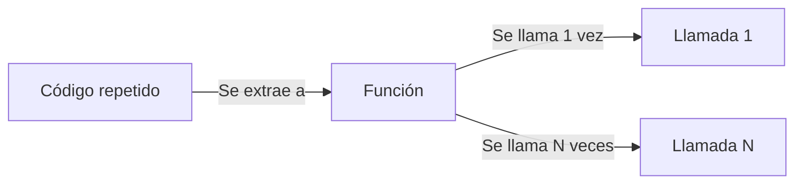
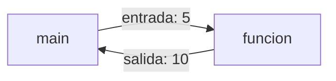
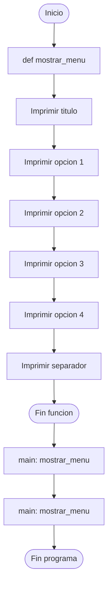
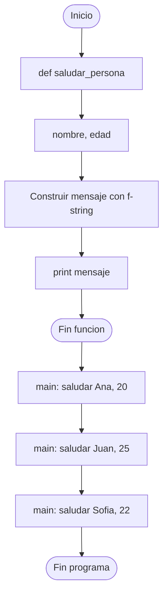
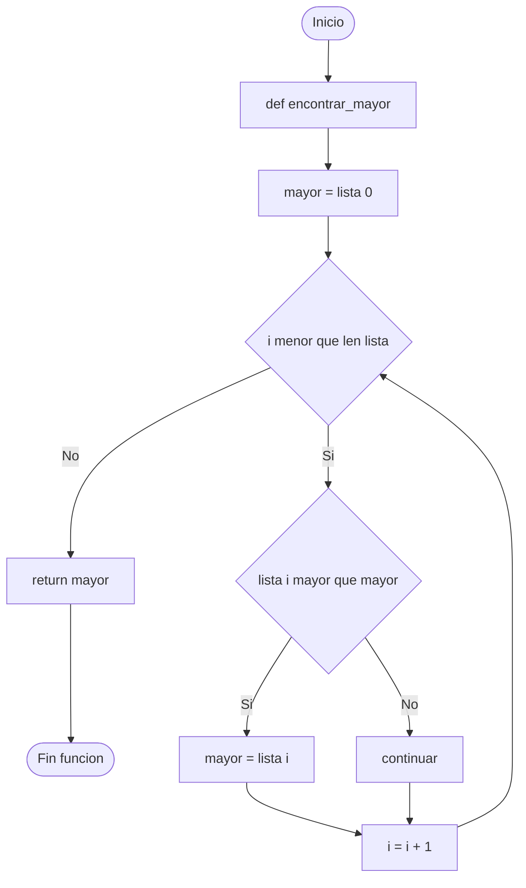

# Funciones en Python

## Código reutilizable, entradas y salidas

### Clase de Programación

<div class="mt-6" style="color: #1a2744; font-weight: 600;">
Profesor: Mateo Taito Stambuk
</div>

<div class="mt-2 text-sm" style="color: #8b1a6e;">
Email: <a href="mailto:mateo.taitos@edu.uai.cl" style="color: #8b1a6e; border: none;">mateo.taitos@edu.uai.cl</a>
</div>

<div class="mt-4 text-sm" style="color: #c45200;">
17 de Julio, 2026
</div>

<style>
.slidev-layout h1 {
  color: #1a2744;
}
.slidev-layout h2 {
  color: #2d3e5f;
}
.slidev-layout h3 {
  color: #8b1a6e;
}
strong {
  color: #1a2744;
}
a {
  color: #c45200;
  font-weight: 600;
  text-decoration: none;
  border-bottom: 2px solid #c45200;
  transition: all 0.2s;
}
a:hover {
  color: #8b1a6e;
  border-color: #8b1a6e;
}
</style>

---

# Objetivos de la Clase

<div class="text-left mt-8 space-y-4">

- <span class="highlight-magenta">Comprender</span> qué es una función y por qué se usan
- <span class="highlight-magenta">Definir</span> funciones sin entradas ni salidas
- <span class="highlight-magenta">Llamar</span> funciones desde el programa principal
- <span class="highlight-magenta">Trabajar</span> con parámetros (entradas) y `return` (salidas)
- <span class="highlight-magenta">Reconocer</span> el scope de variables y la mutabilidad de listas

</div>

<style>
.highlight-magenta {
  color: #8b1a6e;
  font-weight: 700;
}
.highlight-orange {
  color: #c45200;
  font-weight: 700;
}
.highlight-blue {
  color: #1a2744;
  font-weight: 700;
}
</style>

---

# ¿Qué son las Funciones?

## Piezas de código reutilizables

Una <span class="highlight-magenta">función</span> es un bloque de código con **nombre propio** que:

<v-clicks>

- Realiza una tarea **específica**
- Puede ser **llamado** varias veces desde distintos lugares
- Tiene su propio **ámbito** (las variables internas no se mezclan con el resto)

</v-clicks>

<v-click>

<div class="mt-6 p-4 rounded-lg" style="background: #f5f5f5; border-left: 4px solid #1a2744;">

<span class="highlight-blue">Analogía:</span> Una función es como una <strong>receta de cocina</strong>.

- <span class="highlight-blue">Ingredientes</span> → entradas (parámetros)
- <span class="highlight-orange">Pasos</span> → el cuerpo de la función
- <span class="highlight-magenta">Plato terminado</span> → salida (`return`)

</div>

</v-click>

---

# ¿Por qué usar Funciones?

<div class="grid grid-cols-2 gap-6 mt-4">

<div class="p-5 rounded-lg" style="background: #e8f0e8; border-left: 4px solid #1a2744;">

### <span class="highlight-blue">Sin funciones</span>

```python
print("Hola, Ana")
print("Hola, Juan")
print("Hola, Pedro")
```

- Código **repetido**
- Si cambia el saludo, hay que editar **varias** líneas
- Difícil de mantener

</div>

<div class="p-5 rounded-lg" style="background: #f5e6f5; border-left: 4px solid #8b1a6e;">

### <span class="highlight-magenta">Con funciones</span>

```python
def saludar():
    print("Hola, bienvenido")

saludar()
saludar()
saludar()
```

- Código **una sola vez**
- Si cambia el saludo, editas **una** línea
- Fácil de mantener

</div>

</div>

<div class="mt-4 diagram-container">



</div>

<style>
.diagram-container {
  display: flex;
  justify-content: center;
  margin-top: 0.5rem;
}
</style>

---

# Estructura de una Función

## Anatomía de `def`

```python {all|1-2|3|4|1-4}
def saludar():
    print("Hola, bienvenido a la clase")
    print("Esta es una función sin entradas ni salidas")
```

<div class="mt-4 grid grid-cols-4 gap-3">

<div class="p-2 rounded text-center" style="background: #f5f5f5; border-top: 3px solid #1a2744;">

<span class="highlight-blue" style="font-size: 0.9rem;">def</span>

<div class="text-xs">Palabra clave que <strong>define</strong> una función</div>

</div>

<div class="p-2 rounded text-center" style="background: #f5f5f5; border-top: 3px solid #8b1a6e;">

<span class="highlight-magenta" style="font-size: 0.9rem;">saludar</span>

<div class="text-xs">Nombre de la función (verbos en infinitivo)</div>

</div>

<div class="p-2 rounded text-center" style="background: #f5f5f5; border-top: 3px solid #c45200;">

<span class="highlight-orange" style="font-size: 0.9rem;">()</span>

<div class="text-xs">Paréntesis <strong>obligatorios</strong> (entradas)</div>

</div>

<div class="p-2 rounded text-center" style="background: #f5f5f5; border-top: 3px solid #1a2744;">

<span class="highlight-blue" style="font-size: 0.9rem;">:</span>

<div class="text-xs">Dos puntos + bloque <strong>indentado</strong></div>

</div>

</div>

---

# Reglas para Nombrar Funciones

<v-clicks>

- Usar <span class="highlight-blue">verbos en infinitivo</span> que describan la acción:
  - `saludar()`, `mostrar_menu()`, `calcular_promedio()`, `imprimir_tabla()`
- Formato <span class="highlight-magenta">snake_case</span> (palabras separadas con guión bajo):
  - ✅ `calcular_promedio`
  - ❌ `CalcularPromedio`, `calcularpromedio`
- Deben <span class="highlight-orange">empezar con minúscula</span>
- Evitar nombres genéricos como `funcion1`, `proceso`, `hacer_algo`

</v-clicks>

<v-click>

<div class="mt-4 p-3 rounded-lg" style="background: #fff5e6; border-left: 4px solid #c45200;">

<span class="highlight-orange">Convención:</span> Si la función **muestra** algo → `mostrar_X`. Si **calcula** algo → `calcular_X`. Si **busca** algo → `buscar_X` o `encontrar_X`.

</div>

</v-click>

---

# Estructura General del Programa

## `import` → funciones → `resto del programa`

Un archivo `.py` se organiza en <span class="highlight-magenta">tres zonas claras</span>:

<div class="mt-4 p-5 rounded-lg" style="background: #f5f5f5; border: 2px solid #1a2744;">

```python
# ZONA 1: imports (librerías externas)
import random

# ZONA 2: definición de funciones
def saludar():
    print("Hola!")

def mostrar_menu():
    print("1. Jugar")
    print("2. Salir")

# ZONA 3: programa principal
mostrar_menu()
saludar()
```

</div>

<v-clicks>

- <span class="highlight-blue">Zona 1 (imports):</span> arriba del todo, antes de cualquier código
- <span class="highlight-magenta">Zona 2 (funciones):</span> en el medio, solo **definiciones** (con `def`)
- <span class="highlight-orange">Zona 3 (main):</span> al final, las **llamadas** y la lógica principal

</v-clicks>

---

# Diagrama: Estructura del Programa

[Ver diagrama de estructura](./diagramas/01-estructura-programa.png)

---

# Diagrama: Definición de Función

[Ver diagrama de definición](./diagramas/02-definicion-funcion.png)

---

# Llamar a una Función

## Escribir el nombre con paréntesis

```python {all|1-2|4-5|7-8|1-8}
def saludar():
    print("Hola, bienvenido")

# Llamadas a la función
saludar()
saludar()
saludar()
```

<v-clicks>

- <span class="highlight-blue">Línea 1-2:</span> Definimos la función (no hace nada por sí sola)
- <span class="highlight-orange">Líneas 4, 5, 6:</span> Cada vez que escribimos `saludar()` con paréntesis, <span class="highlight-magenta">ejecutamos</span> el bloque
- La misma función puede llamarse <span class="highlight-blue">cuantas veces queramos</span>
- Llamar a la función es <span class="highlight-orange">ejecutar</span>, definir es solo <span class="highlight-blue">preparar</span>

</v-clicks>

---

# Trazado de la Ejecución

## ¿Qué pasa cuando llamamos a la función?

<div class="grid grid-cols-2 gap-5 mt-4">

<div>

**Código:**

```python
def saludar():
    print("Hola!")
    print("Chao!")

print("Inicio")
saludar()
print("Fin")
```

</div>

<div>

**Salida en pantalla:**

```
Inicio
Hola!
Chao!
Fin
```

<v-click>

<div class="mt-2 p-2 rounded text-sm" style="background: #f5e6f5; border-left: 3px solid #8b1a6e;">

<span class="highlight-magenta">El flujo "entra" a la función, ejecuta su bloque, y vuelve al mismo lugar donde se llamó.</span>

</div>

</v-click>

</div>

</div>

---

# Funciones que Llaman a Otras Funciones

```python {all|1-2|4-7|9-11|1-11}
def saludar():
    print("Hola!")

def despedir():
    print("Chao!")

def sesion():
    saludar()
    print("Bienvenido a la clase")
    despedir()

sesion()
```

<v-clicks>

- <span class="highlight-blue">`saludar()` y `despedir()`:</span> funciones simples sin entradas ni salidas
- <span class="highlight-magenta">`sesion()`:</span> función que llama a <span class="highlight-magenta">otras</span> funciones
- Cuando `sesion()` se llama, ejecuta `saludar()`, luego `despedir()`
- Una función puede llamar a <span class="highlight-orange">tantas otras</span> como necesite

</v-clicks>

---

# Diagrama: Llamada de Función

[Ver diagrama de llamada](./diagramas/03-llamada-funcion.png)

---

# Ejemplo 1: Función `saludar()`

## Enunciado

Crear un programa que muestre un saludo en pantalla usando una <span class="highlight-magenta">función sin entradas ni salidas</span>.

<v-clicks>

- La función debe imprimir un mensaje de bienvenida
- La función debe llamarse <span class="highlight-blue">al menos 3 veces</span> desde el programa principal
- El código debe seguir la estructura: <span class="highlight-orange">imports → funciones → main</span>

</v-clicks>

---

# Ejemplo 1: Código Completo

```python {all|1|3-5|7-9|1-9}
# 1. Imports
# (ninguno en este ejemplo)

# 2. Definicion de funciones
def saludar():
    print("Hola, bienvenido a la clase de programacion")
    print("Espero que aprendamos mucho hoy")

# 3. Programa principal
saludar()
saludar()
saludar()
```

---

# Ejemplo 1: Trazado Paso a Paso

<v-clicks>

| Paso | Acción | ¿Qué pasa? |
|------|--------|-------------|
| 1 | Python lee el archivo de arriba hacia abajo | Encuentra `def saludar()` → la <span class="highlight-blue">define</span> |
| 2 | Línea 7: `saludar()` | <span class="highlight-magenta">Entra</span> a la función |
| 3 | Línea 4: `print("Hola, ...")` | Imprime el primer mensaje |
| 4 | Línea 5: `print("Espero...")` | Imprime el segundo mensaje |
| 5 | Fin de la función | <span class="highlight-orange">Vuelve</span> a la línea 7 |
| 6 | Línea 8: `saludar()` | Repite todo el proceso |
| 7 | Línea 9: `saludar()` | Repite una tercera vez |

</v-clicks>

<v-click>

<div class="mt-3 p-3 rounded-lg" style="background: #f5e6f5; border-left: 4px solid #8b1a6e;">

<span class="highlight-magenta">Salida final:</span> el mensaje se imprime 3 veces, una tras otra.

</div>

</v-click>

---

# Entradas y Salidas: Concepto

## ¿Cómo una función recibe datos y devuelve resultados?

<div class="mt-4 grid grid-cols-2 gap-5">

<div class="p-4 rounded-lg" style="background: #e8f0e8; border-left: 4px solid #1a2744;">

### <span class="highlight-blue">Entradas (parámetros)</span>

Información que la función <span class="highlight-blue">recibe</span> para trabajar.

```python
def saludar(nombre):
    print(f"Hola, {nombre}")
```

`nombre` es el parámetro: el dato que <span class="highlight-blue">llega</span> desde afuera.

</div>

<div class="p-4 rounded-lg" style="background: #f5e6f5; border-left: 4px solid #8b1a6e;">

### <span class="highlight-magenta">Salidas (`return`)</span>

Resultado que la función <span class="highlight-magenta">devuelve</span> al llamador.

```python
def doble(numero):
    return numero * 2
```

`return` <span class="highlight-magenta">devuelve</span> un valor para ser usado fuera.

</div>

</div>

<div class="mt-4 diagram-container">



</div>

<style>
.diagram-container {
  display: flex;
  justify-content: center;
}
</style>

---

# `print` vs `return`

## ¡No son lo mismo!

<div class="grid grid-cols-2 gap-5 mt-4">

<div>

### <span class="highlight-orange">`print`</span>

<span class="highlight-orange">Muestra</span> un mensaje en pantalla.

```python
def saludar(nombre):
    print(f"Hola, {nombre}")
```

- La función <span class="highlight-orange">no devuelve</span> nada
- Solo <span class="highlight-orange">imprime</span>
- No se puede guardar el resultado

</div>

<div>

### <span class="highlight-magenta">`return`</span>

<span class="highlight-magenta">Devuelve</span> un valor al llamador.

```python
def saludar(nombre):
    return f"Hola, {nombre}"
```

- La función <span class="highlight-magenta">devuelve</span> un string
- Se puede guardar: `msg = saludar("Ana")`
- Se puede usar en una expresión

</div>

</div>

<v-click>

<div class="mt-3 p-3 rounded-lg" style="background: #fff5e6; border-left: 4px solid #c45200;">

<span class="highlight-orange">Regla práctica:</span> Si la función <strong>calcula</strong> algo y otro código necesita ese resultado → usa `return`. Si solo quieres <strong>mostrar</strong> un mensaje → usa `print`.

</div>

</v-click>

---

# Parámetros: La Entrada de la Función

## Sintaxis

```python {all|1|2|3|1-3}
def saludar(nombre):
    print(f"Hola, {nombre}")
```

<v-clicks>

- <span class="highlight-blue">`nombre`</span> es el <span class="highlight-magenta">parámetro</span> de la función
- Es una <span class="highlight-blue">variable local</span> que existe solo dentro de la función
- Se <span class="highlight-orange">inicializa</span> en el momento de la llamada
- Al terminar la función, <span class="highlight-magenta">desaparece</span>

</v-clicks>

---

# Pasar Argumentos en la Llamada

```python {all|1-2|4-6|1-6}
def saludar(nombre, edad):
    print(f"Hola, {nombre}, tienes {edad} años")

# Llamadas con argumentos posicionales
saludar("Ana", 20)
saludar("Juan", 25)
saludar("Sofia", 22)
```

<v-clicks>

- <span class="highlight-blue">`nombre` y `edad`</span> son los <span class="highlight-magenta">parámetros</span> (en la definición)
- <span class="highlight-orange">`"Ana"` y `20`</span> son los <span class="highlight-orange">argumentos</span> (en la llamada)
- Los argumentos se asignan <span class="highlight-blue">en orden</span> a los parámetros
- Se pueden tener <span class="highlight-magenta">tantos parámetros</span> como la función necesite

</v-clicks>

---

# Múltiples Parámetros

## Ejemplo con dos y tres entradas

<div class="grid grid-cols-2 gap-4 mt-4">

<div>

**Dos parámetros:**

```python
def calcular_area(base, altura):
    area = base * altura
    print(f"Area: {area}")

calcular_area(5, 3)
# Imprime: Area: 15
```

</div>

<div>

**Tres parámetros:**

```python
def crear_mensaje(nombre, accion, objeto):
    print(f"{nombre} {accion} {objeto}")

crear_mensaje("Ana", "compra", "pan")
# Imprime: Ana compra pan
```

</div>

</div>

<v-click>

<div class="mt-3 p-3 rounded-lg" style="background: #f5e6f5; border-left: 4px solid #8b1a6e;">

<span class="highlight-magenta">Or importante:</span> El orden de los argumentos debe coincidir con el orden de los parámetros.

```python
crear_mensaje("compra", "Ana", "pan")
# Imprime: compra Ana pan  (¡incorrecto!)
```

</div>

</v-click>

---

# Variables Escalares: Paso por Valor

## Las variables escalares (números, strings) **no se modifican** fuera

```python {all|1-3|5-7|1-7}
def intentar_cambiar(x):
    x = 100
    print(f"Dentro: {x}")

numero = 5
intentar_cambiar(numero)
print(f"Fuera: {numero}")
```

**Salida:**

```
Dentro: 100
Fuera: 5
```

<v-clicks>

- <span class="highlight-blue">Dentro</span> de la función, `x` vale `100`
- <span class="highlight-orange">Fuera</span>, `numero` sigue valiendo `5`
- La función recibe una <span class="highlight-magenta">copia</span>, no el original
- Modificar la copia <span class="highlight-magenta">no afecta</span> al original

</v-clicks>

---

# Diagrama: Flujo de Entradas y Salidas

[Ver diagrama de entradas y salidas](./diagramas/04-flujo-entradas-salidas.png)

---

# La Sentencia `return`

## Devolver un valor al llamador

```python {all|1-2|4|5-6|1-6}
def doble(numero):
    return numero * 2

resultado = doble(7)
print(resultado)
print(doble(7) + doble(3))
```

<v-clicks>

- <span class="highlight-blue">Línea 1-2:</span> La función devuelve el doble
- <span class="highlight-orange">Línea 4:</span> `return numero * 2` <span class="highlight-magenta">devuelve</span> `14`
- <span class="highlight-blue">Línea 4:</span> `resultado` <span class="highlight-blue">guarda</span> ese `14`
- <span class="highlight-magenta">Línea 6:</span> Podemos usar el valor de `return` directamente en expresiones

</v-clicks>

---

# Usar el Valor Devuelto

## Tres formas equivalentes

<div class="grid grid-cols-3 gap-4 mt-4">

<div class="p-3 rounded-lg" style="background: #e8f0e8; border-left: 4px solid #1a2744;">

### <span class="highlight-blue">1. Guardar</span>

```python
resultado = doble(5)
print(resultado)
```

</div>

<div class="p-3 rounded-lg" style="background: #f5e6f5; border-left: 4px solid #8b1a6e;">

### <span class="highlight-magenta">2. Usar directo</span>

```python
print(doble(5))
```

</div>

<div class="p-3 rounded-lg" style="background: #ffe8e0; border-left: 4px solid #c45200;">

### <span class="highlight-orange">3. En expresión</span>

```python
total = doble(5) + doble(3)
```

</div>

</div>

<v-click>

<div class="mt-4 p-3 rounded-lg" style="background: #f5f5f5; border-left: 4px solid #1a2744;">

<span class="highlight-blue">`return` también termina la función</span>: cualquier código después de `return` <span class="highlight-orange">no se ejecuta</span>.

```python
def ejemplo():
    return 10
    print("Esto NUNCA se imprime")
```

</div>

</v-click>

---

# Múltiples `return`

## Retornos condicionales

```python {all|1-2|3-6|1-6}
def clasificar_edad(edad):
    if edad < 0:
        return "Edad invalida"
    if edad < 18:
        return "Menor de edad"
    if edad < 65:
        return "Adulto"
    return "Adulto mayor"

print(clasificar_edad(15))
print(clasificar_edad(30))
print(clasificar_edad(70))
```

<v-clicks>

- <span class="highlight-blue">Cada `return`</span> devuelve un valor <span class="highlight-magenta">distinto</span>
- <span class="highlight-orange">Solo se ejecuta uno</span> (el primero que coincida con la condición)
- Los demás `return` <span class="highlight-blue">no se evalúan</span>
- Sirve para <span class="highlight-magenta">manejar casos</span> diferentes

</v-clicks>

---

# ¿Qué pasa si no hay `return`?

## La función devuelve `None`

```python {all|1-2|4-5|1-5}
def saludar(nombre):
    print(f"Hola, {nombre}")

resultado = saludar("Ana")
print(resultado)
```

**Salida:**

```
Hola, Ana
None
```

<v-clicks>

- La función <span class="highlight-orange">no tiene `return`</span> explícito
- Python devuelve <span class="highlight-magenta">`None`</span> automáticamente
- `None` significa <span class="highlight-blue">"nada"</span> o <span class="highlight-blue">"ausencia de valor"</span>

</v-clicks>

---

# Ejemplo 2: `calcular_promedio()`

## Enunciado

Crear una función que reciba una <span class="highlight-magenta">lista de notas</span> y <span class="highlight-magenta">devuelva</span> el promedio.

<v-clicks>

- La función recibe una lista como <span class="highlight-blue">entrada</span>
- Calcula el promedio (suma / cantidad)
- <span class="highlight-magenta">Devuelve</span> el resultado con `return`
- Se debe llamar desde el programa principal y mostrar el resultado

</v-clicks>

---

# Ejemplo 2: Código Completo

```python {all|1|3-6|8-9|11-13|1-13}
# 1. Definicion de funciones
def calcular_promedio(notas):
    suma = 0
    for nota in notas:
        suma = suma + nota
    promedio = suma / len(notas)
    return promedio

# 2. Programa principal
notas_alumno = [5.5, 6.0, 4.8, 7.0, 5.2]
promedio_final = calcular_promedio(notas_alumno)
print(f"El promedio es: {promedio_final:.2f}")
```

---

# Ejemplo 2: Trazado Paso a Paso

<div class="grid grid-cols-2 gap-5 mt-3">

<div>

**Datos:** `notas = [5.5, 6.0, 4.8, 7.0, 5.2]`

</div>

<div>

**Cálculo:**

| Paso | Operación | Valor |
|------|-----------|-------|
| 1 | `suma = 0` | `0` |
| 2 | `suma + 5.5` | `5.5` |
| 3 | `suma + 6.0` | `11.5` |
| 4 | `suma + 4.8` | `16.3` |
| 5 | `suma + 7.0` | `23.3` |
| 6 | `suma + 5.2` | `28.5` |
| 7 | `28.5 / 5` | `5.70` |

</div>

</div>

<v-click>

<div class="mt-3 p-3 rounded-lg" style="background: #f5e6f5; border-left: 4px solid #8b1a6e;">

<span class="highlight-magenta">Salida final:</span>

```
El promedio es: 5.70
```

La función <span class="highlight-magenta">devuelve</span> el valor y el programa principal lo <span class="highlight-blue">usa</span>.

</div>

</v-click>

---

# Ejemplo 2: Usos del Valor Devuelto

```python
notas_curso = [5.5, 6.0, 4.8, 7.0, 5.2]

# Uso 1: guardar en variable
prom = calcular_promedio(notas_curso)
print(f"Promedio: {prom:.2f}")

# Uso 2: usar en una condicion
if calcular_promedio(notas_curso) >= 4.0:
    print("Aprueba")

# Uso 3: pasar a otra funcion
print(f"Max: {max(notas_curso)}")
print(f"Prom: {calcular_promedio(notas_curso):.2f}")
```

<v-click>

<div class="mt-3 p-3 rounded-lg" style="background: #f5f5f5; border-left: 4px solid #1a2744;">

<span class="highlight-blue">Gracias al `return`, el valor de la función se comporta como cualquier otro valor:</span> se guarda, se compara, se mezcla con otras operaciones.

</div>

</v-click>

---

# Característica 1: Scope de Variables

## Las variables creadas **dentro** de la función solo existen **allí**

```python {all|1-3|5-6|8-9|1-9}
def mi_funcion():
    mensaje = "Hola desde adentro"
    print(mensaje)

mi_funcion()
print(mensaje)  # ERROR
```

<v-clicks>

- <span class="highlight-blue">Línea 1-3:</span> `mensaje` se crea <span class="highlight-magenta">dentro</span> de la función
- <span class="highlight-blue">Línea 5:</span> Al llamar a la función, `mensaje` <span class="highlight-orange">existe</span>
- <span class="highlight-orange">Línea 8:</span> Fuera de la función, `mensaje` <span class="highlight-magenta">no existe</span> → <span class="highlight-magenta">NameError</span>

</v-clicks>

<v-click>

<div class="mt-3 p-3 rounded-lg" style="background: #fff5e6; border-left: 4px solid #c45200;">

<span class="highlight-orange">Esto se llama "scope local":</span> las variables definidas en una función están <strong>aisladas</strong> del resto del programa.

</div>

</v-click>

---

# Scope Local en Acción

```python {all|1-2|4-6|8-9|1-9}
def funcion_a():
    x = 10
    print(f"En A: {x}")

def funcion_b():
    x = 20
    print(f"En B: {x}")

funcion_a()
funcion_b()
print(x)  # ERROR: x no existe fuera
```

**Salida:**

```
En A: 10
En B: 20
NameError: name 'x' is not defined
```

<v-clicks>

- Cada función tiene su <span class="highlight-blue">propia variable `x`</span>
- Son <span class="highlight-magenta">independientes</span>: la `x` de A no afecta a la `x` de B
- Fuera de las funciones, <span class="highlight-orange">ninguna `x` existe</span>

</v-clicks>

---

# Diagrama: Scope de Variables

[Ver diagrama de scope](./diagramas/05-scope-variables.png)

---

# Característica 2: Mutabilidad de Listas

## Las listas externas **sí** se pueden modificar dentro de la función

```python {all|1-2|4-5|7-9|1-9}
def agregar_elemento(lista, elemento):
    lista.append(elemento)
    print(f"Dentro: {lista}")

mis_notas = [5.5, 6.0]
agregar_elemento(mis_notas, 7.0)
print(f"Fuera: {mis_notas}")
```

**Salida:**

```
Dentro: [5.5, 6.0, 7.0]
Fuera: [5.5, 6.0, 7.0]
```

<v-clicks>

- La lista <span class="highlight-magenta">se modifica dentro</span> de la función
- Y el cambio <span class="highlight-blue">persiste afuera</span>
- Esto es distinto a las <span class="highlight-orange">variables escalares</span> (que no se modifican)

</v-clicks>

---

# ¿Por qué pasa esto?

## Listas vs Escalares: la diferencia clave

<div class="grid grid-cols-2 gap-5 mt-4">

<div class="p-4 rounded-lg" style="background: #e8f0e8; border-left: 4px solid #1a2744;">

### <span class="highlight-blue">Escalares (números, strings)</span>

```python
def cambiar(x):
    x = 100

n = 5
cambiar(n)
print(n)  # 5
```

<span class="highlight-blue">Se pasa una <strong>copia</strong>.</span>

</div>

<div class="p-4 rounded-lg" style="background: #f5e6f5; border-left: 4px solid #8b1a6e;">

### <span class="highlight-magenta">Listas</span>

```python
def agregar(lista):
    lista.append(99)

nums = [1, 2]
agregar(nums)
print(nums)  # [1, 2, 99]
```

<span class="highlight-magenta">Se pasa una <strong>referencia</strong>.</span>

</div>

</div>

<v-click>

<div class="mt-3 p-3 rounded-lg" style="background: #fff5e6; border-left: 4px solid #c45200;">

<span class="highlight-orange">Analogía:</span> Un escalar es como una <strong>copia de un papel</strong>: lo que escribas en la copia no afecta al original. Una lista es como una <strong>dirección de una casa</strong>: si modificas la casa, el cambio es visible para todos los que tengan la dirección.

</div>

</v-click>

---

# Diagrama: Mutabilidad de Listas

[Ver diagrama de mutabilidad](./diagramas/06-mutabilidad-listas.png)

---

# Resumen: Comportamiento por Tipo

| Tipo de dato | Se modifica fuera? | Razón |
|--------------|-------------------|-------|
| `int`, `float`, `str`, `bool` | <span class="highlight-orange">No</span> | Se pasa una <span class="highlight-orange">copia</span> |
| `list`, `dict` | <span class="highlight-magenta">Sí</span> | Se pasa una <span class="highlight-magenta">referencia</span> |

<v-click>

<div class="mt-4 p-3 rounded-lg" style="background: #f5f5f5; border-left: 4px solid #1a2744;">

<span class="highlight-blue">Consecuencia práctica:</span> Si no quieres que la función modifique tu lista original, <span class="highlight-magenta">pasa una copia</span>:

```python
agregar_elemento(mis_notas[:], 7.0)  # [:] crea una copia
```

</div>

</v-click>

---

# Ejercicio 1: Mostrar Menú

## Enunciado del Problema

Un programa de consola debe mostrar un menú con <span class="highlight-magenta">tres opciones</span> cada vez que se necesita.

```text
========== MENU PRINCIPAL ==========
1. Jugar
2. Ver puntaje
3. Salir
====================================
```

<span class="highlight-orange">Misión:</span> Crear una función `mostrar_menu()` que imprima el menú, y llamarla al menos <span class="highlight-magenta">dos veces</span> en el programa principal.

---

# Ejercicio 1: Planteamiento

<div class="grid grid-cols-2 gap-5 mt-3">

<div>

### <span class="highlight-blue">Variables</span>

- No hay variables externas
- La función <span class="highlight-blue">no recibe</span> parámetros
- La función <span class="highlight-blue">no devuelve</span> nada

</div>

<div>

### <span class="highlight-orange">Lógica</span>

- `def mostrar_menu():`
- Imprimir líneas con `print`
- Usar `print` (no `return`, porque solo queremos mostrar)

</div>

</div>

<v-click>

<div class="mt-3 p-3 rounded-lg" style="background: #f5f5f5; border-left: 4px solid #8b1a6e;">

<span class="highlight-magenta">Salida esperada</span> (al llamar la función 2 veces): el menú se imprime completo, dos veces.

</div>

</v-click>

---

# Ejercicio 1: Diagrama de Flujo

<div class="diagram-container">



</div>

<style>
.diagram-container {
  display: flex;
  justify-content: center;
  transform: scale(0.85);
  transform-origin: top center;
  margin-top: -1rem;
}
</style>

---

# Ejercicio 1: Código Completo

```python {all|1|3-9|11-13|1-13}
# 1. Definicion de la funcion
def mostrar_menu():
    print("========== MENU PRINCIPAL ==========")
    print("1. Jugar")
    print("2. Ver puntaje")
    print("3. Ver configuracion")
    print("4. Salir")
    print("====================================")

# 2. Programa principal
mostrar_menu()
print("Cargando datos del jugador...")
mostrar_menu()
```

---

# Ejercicio 1: Explicación Detallada

<v-clicks>

- <span class="highlight-blue">Líneas 1-9:</span> Definimos `mostrar_menu()`. No tiene parámetros ni `return`. Solo imprime.
- <span class="highlight-magenta">Línea 3:</span> `==========` decorativos para que el menú se vea ordenado.
- <span class="highlight-orange">Líneas 4-7:</span> Cada `print` muestra una opción numerada.
- <span class="highlight-blue">Línea 8:</span> Línea decorativa final.
- <span class="highlight-magenta">Línea 11:</span> Primera llamada al menú (aparece arriba de "Cargando datos...").
- <span class="highlight-orange">Línea 12:</span> Una acción intermedia (no es la función, es código normal).
- <span class="highlight-magenta">Línea 13:</span> Segunda llamada. El menú aparece <span class="highlight-magenta">idéntico</span> porque es la misma función.

</v-clicks>

---

# Ejercicio 1: Revisar

## Caso de prueba: 2 llamadas

**Salida esperada:**

```
========== MENU PRINCIPAL ==========
1. Jugar
2. Ver puntaje
3. Ver configuracion
4. Salir
====================================
Cargando datos del jugador...
========== MENU PRINCIPAL ==========
1. Jugar
2. Ver puntaje
3. Ver configuracion
4. Salir
====================================
```

<v-click>

<div class="mt-2 p-2 rounded text-center" style="background: #f5e6f5; border-left: 3px solid #8b1a6e;">

<span class="highlight-magenta">El menú aparece completo, dos veces, separadas por el mensaje intermedio.</span>

</div>

</v-click>

---

# Ejercicio 2: Saludar Persona

## Enunciado del Problema

Necesitamos una función que reciba un <span class="highlight-magenta">nombre</span> y una <span class="highlight-magenta">edad</span>, e imprima un saludo personalizado.

```text
Hola Ana, tienes 20 años. Bienvenido a la clase.
Hola Juan, tienes 25 años. Bienvenido a la clase.
```

<span class="highlight-orange">Misión:</span> Crear `saludar_persona(nombre, edad)` que use <span class="highlight-magenta">f-strings</span> y llamarla con al menos 3 personas distintas.

---

# Ejercicio 2: Planteamiento

<div class="grid grid-cols-2 gap-5 mt-3">

<div>

### <span class="highlight-blue">Variables (parámetros)</span>

- `nombre`: string con el nombre
- `edad`: número entero

</div>

<div>

### <span class="highlight-orange">Lógica</span>

- `def saludar_persona(nombre, edad):`
- Construir el mensaje con f-string
- Imprimir el resultado con `print`

</div>

</div>

<v-click>

<div class="mt-3 p-3 rounded-lg" style="background: #f5f5f5; border-left: 4px solid #8b1a6e;">

<span class="highlight-magenta">Diferencia con Ejercicio 1:</span> Esta función <strong>sí</strong> recibe <span class="highlight-magenta">entradas</span> (parámetros), pero <strong>no</strong> devuelve nada (usa `print`).

</div>

</v-click>

---

# Ejercicio 2: Diagrama de Flujo

<div class="diagram-container">



</div>

<style>
.diagram-container {
  display: flex;
  justify-content: center;
  transform: scale(0.85);
  transform-origin: top center;
  margin-top: -1rem;
}
</style>

---

# Ejercicio 2: Código Completo

```python {all|1-2|4-5|7-10|1-10}
# 1. Definicion de la funcion
def saludar_persona(nombre, edad):
    print(f"Hola {nombre}, tienes {edad} años. Bienvenido a la clase.")

# 2. Programa principal
saludar_persona("Ana", 20)
saludar_persona("Juan", 25)
saludar_persona("Sofia", 22)
```

---

# Ejercicio 2: Explicación Detallada

<v-clicks>

- <span class="highlight-blue">Línea 1-2:</span> `def saludar_persona(nombre, edad):` define la función con <span class="highlight-magenta">dos parámetros</span>.
- <span class="highlight-orange">Línea 2:</span> f-string con `{nombre}` y `{edad}`: los <span class="highlight-magenta">placeholders</span> se reemplazan con los valores recibidos.
- <span class="highlight-blue">Línea 5:</span> `saludar_persona("Ana", 20)` → `"Ana"` se asigna a `nombre`, `20` se asigna a `edad`.
- <span class="highlight-magenta">Líneas 6, 7:</span> Las llamadas con `"Juan", 25` y `"Sofia", 22` repiten el proceso con otros valores.
- <span class="highlight-blue">Convención:</span> Los <span class="highlight-magenta">parámetros</span> van en la definición (`nombre, edad`). Los <span class="highlight-orange">argumentos</span> van en la llamada (`"Ana", 20`).

</v-clicks>

---

# Ejercicio 2: Revisar

## Trazado de las llamadas

<div class="mt-3 p-3 rounded-lg" style="background: #f5f5f5; border: 2px solid #1a2744;">

**Datos de prueba:**

</div>

| Llamada | `nombre` | `edad` | Salida |
|---------|----------|--------|--------|
| `saludar_persona("Ana", 20)` | `"Ana"` | `20` | `Hola Ana, tienes 20 años...` |
| `saludar_persona("Juan", 25)` | `"Juan"` | `25` | `Hola Juan, tienes 25 años...` |
| `saludar_persona("Sofia", 22)` | `"Sofia"` | `22` | `Hola Sofia, tienes 22 años...` |

<v-click>

<div class="mt-2 p-2 rounded text-center" style="background: #f5e6f5; border-left: 3px solid #8b1a6e;">

<span class="highlight-magenta">La misma función produce mensajes distintos según los argumentos.</span>

</div>

</v-click>

---

# Ejercicio 3: Encontrar el Mayor

## Enunciado del Problema

Necesitamos una función que reciba una <span class="highlight-magenta">lista de números</span> y <span class="highlight-magenta">devuelva</span> el mayor de todos.

```python
numeros = [4, 2, 8, 1, 9, 5, 3]
mayor = encontrar_mayor(numeros)
print(mayor)  # 9
```

<span class="highlight-orange">Misión:</span> Crear `encontrar_mayor(lista)` que use `return` para devolver el valor, y probarla con al menos <span class="highlight-magenta">3 listas</span> distintas.

---

# Ejercicio 3: Planteamiento

<div class="grid grid-cols-2 gap-5 mt-3">

<div>

### <span class="highlight-blue">Variables (parámetro)</span>

- `numeros`: lista de enteros o flotantes
- Variable local: `mayor_actual` para跟踪

</div>

<div>

### <span class="highlight-orange">Lógica</span>

- Empezar con `mayor = numeros[0]`
- Recorrer la lista con `for`
- Si `numeros[i] > mayor`, actualizar
- `return mayor` al final

</div>

</div>

<v-click>

<div class="mt-3 p-3 rounded-lg" style="background: #f5f5f5; border-left: 4px solid #8b1a6e;">

<span class="highlight-magenta">Aquí sí usamos `return`:</span> la función <strong>calcula</strong> un valor y el llamador lo <strong>usa</strong>.

</div>

</v-click>

---

# Ejercicio 3: Diagrama de Flujo

<div class="diagram-container">



</div>

<style>
.diagram-container {
  display: flex;
  justify-content: center;
  transform: scale(0.75);
  transform-origin: top center;
  margin-top: -1rem;
}
</style>

---

# Ejercicio 3: Código Completo

```python {all|1|3-4|5|6-8|9|11-14|1-14}
# 1. Definicion de la funcion
def encontrar_mayor(numeros):
    mayor = numeros[0]
    for i in range(1, len(numeros)):
        if numeros[i] > mayor:
            mayor = numeros[i]
    return mayor

# 2. Programa principal
lista_a = [4, 2, 8, 1, 9, 5, 3]
lista_b = [10, 5, 7]
lista_c = [-3, -10, -1, -5]

print(f"Mayor de A: {encontrar_mayor(lista_a)}")
print(f"Mayor de B: {encontrar_mayor(lista_b)}")
print(f"Mayor de C: {encontrar_mayor(lista_c)}")
```

---

# Ejercicio 3: Explicación Detallada

<v-clicks>

- <span class="highlight-blue">Línea 1-2:</span> Definimos `encontrar_mayor(numeros)`. Recibe una lista.
- <span class="highlight-orange">Línea 3:</span> Inicializamos `mayor` con el <span class="highlight-magenta">primer elemento</span> (será nuestra referencia inicial).
- <span class="highlight-blue">Línea 4:</span> `range(1, len(numeros))`: empezamos desde la posición 1, porque la 0 ya la usamos.
- <span class="highlight-magenta">Línea 5-6:</span> Si el elemento actual es <span class="highlight-magenta">mayor</span> que `mayor`, lo actualizamos.
- <span class="highlight-orange">Línea 8:</span> `return mayor` devuelve el valor encontrado.
- <span class="highlight-blue">Línea 11-13:</span> Tres listas distintas, todas se procesan con la <span class="highlight-magenta">misma función</span>.
- <span class="highlight-magenta">Línea 15-17:</span> Usamos el valor de retorno directamente dentro de f-strings.

</v-clicks>

---

# Ejercicio 3: Revisar

## Trazado con `lista_a = [4, 2, 8, 1, 9, 5, 3]`

| Iteración | `i` | `numeros[i]` | `mayor` antes | `mayor` después |
|-----------|-----|--------------|---------------|-----------------|
| Inicio | - | - | - | `4` |
| 1 | 1 | `2` | `4` | `4` |
| 2 | 2 | `8` | `4` | <span class="highlight-magenta">`8`</span> |
| 3 | 3 | `1` | `8` | `8` |
| 4 | 4 | `9` | `8` | <span class="highlight-magenta">`9`</span> |
| 5 | 5 | `5` | `9` | `9` |
| 6 | 6 | `3` | `9` | `9` |

<v-click>

<div class="mt-2 p-2 rounded text-center" style="background: #f5e6f5; border-left: 3px solid #8b1a6e;">

<span class="highlight-magenta">`return` devuelve `9`. La lista B devolvería `10`, la lista C devolvería `-1`.</span>

</div>

</v-click>

---

# Resumen de la Clase

## Conceptos fundamentales

<div class="grid grid-cols-3 gap-4 mt-4">

<div class="concept-card">
<h4 class="highlight-blue">Funciones básicas</h4>
<ul>

- Definir con `def nombre():`
- Llamar con `nombre()`
- Bloque indentado
- Tres zonas: `import` → funciones → main

</ul>
</div>

<div class="concept-card">
<h4 class="highlight-magenta">Entradas y salidas</h4>
<ul>

- Parámetros: entradas (entre paréntesis)
- `return`: valor devuelto
- Múltiples parámetros permitidos
- `print` muestra, `return` devuelve

</ul>
</div>

<div class="concept-card">
<h4 class="highlight-orange">Scope y mutabilidad</h4>
<ul>

- Variables locales: solo dentro de la función
- Escalares: no se modifican fuera
- Listas: sí se modifican fuera
- Usar `lista[:]` para evitarlo

</ul>
</div>

</div>

<style>
.concept-card {
  background: white;
  border-left: 4px solid;
  padding: 1rem 1.25rem;
  border-radius: 0 8px 8px 0;
  box-shadow: 0 2px 8px rgba(0,0,0,0.05);
}
.concept-card:nth-child(1) { border-color: #1a2744; }
.concept-card:nth-child(2) { border-color: #8b1a6e; }
.concept-card:nth-child(3) { border-color: #c45200; }
.concept-card h4 {
  margin: 0 0 0.75rem 0;
  font-size: 1rem;
}
.concept-card ul {
  margin: 0;
  padding-left: 1.1rem;
  font-size: 0.9rem;
}
</style>

---

# Conceptos Reforzados

## Lo que practicamos hoy

<v-clicks>

- <span class="highlight-blue">Estructura del programa:</span> imports → funciones → main
- <span class="highlight-magenta">Definir y llamar funciones</span> sin entradas ni salidas
- <span class="highlight-orange">Parámetros y `return`</span> para funciones con entradas y salidas
- <span class="highlight-blue">Diferencia entre `print` y `return`</span>
- <span class="highlight-magenta">Scope de variables locales</span> y la mutabilidad de listas externas
- <span class="highlight-orange">Diagramas de flujo</span> para planificar la lógica de cada función

</v-clicks>

<v-click>

<div class="mt-6 p-4 rounded-lg text-center" style="background: #f5f5f5; border: 2px solid #1a2744;">

**Regla de oro:** Una buena función hace <strong>una sola cosa</strong>, tiene un nombre claro (verbo) y, si calcula algo, lo devuelve con `return`.

</div>

</v-click>

---

layout: center
class: text-center
---

<div class="thank-you">
<h1>¡Gracias!</h1>
<h2>¿Preguntas?</h2>
</div>

<div class="mt-8 text-sm" style="color: #888;">
Funciones en Python
</div>

<style>
.thank-you h1 {
  font-size: 4rem;
  color: #1a2744;
  margin-bottom: 1rem;
}
.thank-you h2 {
  font-size: 2rem;
  color: #c45200;
  font-weight: 400;
}
</style>
