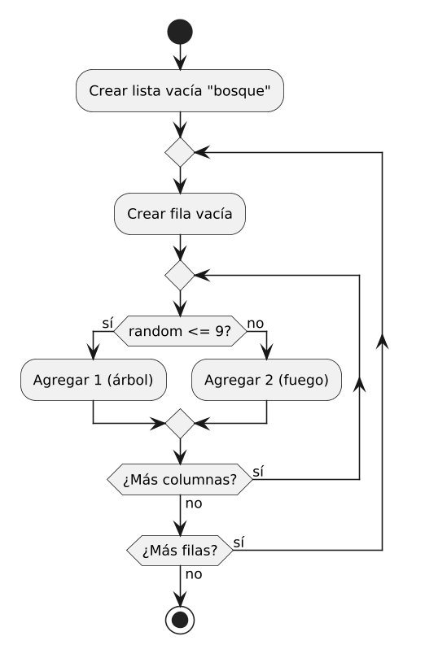
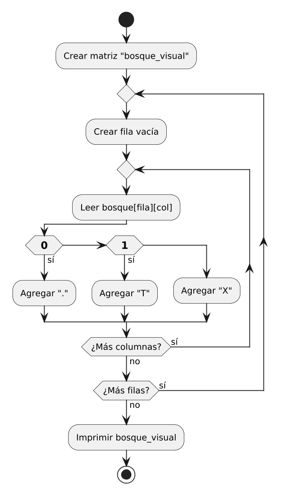
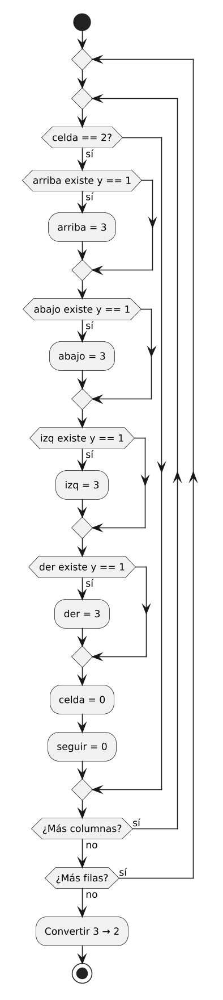
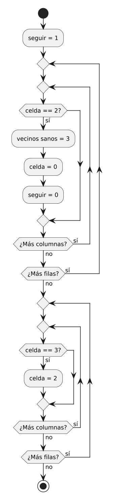
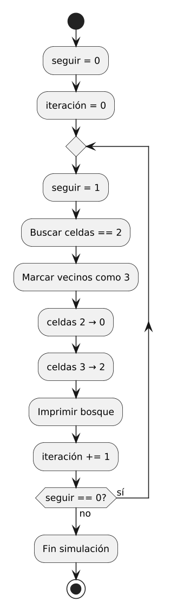
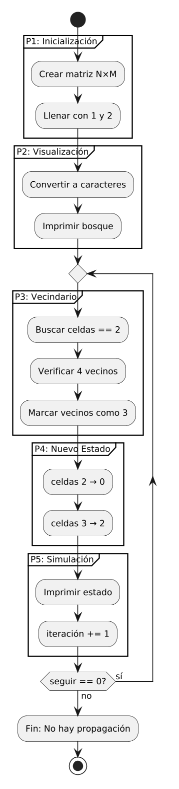

# Simulación de Propagación de Incendio

## Resolución paso a paso en Python

### Clase de Programación

<div class="mt-8 text-sm opacity-70">
27 de Mayo, 2026
</div>

---
layout: center
class: text-center
---

# Objetivos de la Clase

<div class="text-left mt-8 space-y-4">

- <span class="highlight">Modelar</span> un sistema dinámico usando matrices
- <span class="highlight">Practicar</span> listas anidadas, índices y mutabilidad
- <span class="highlight">Desarrollar</span> funciones modulares y reutilizables
- <span class="highlight">Comprender</span> la simulación por pasos discretos
- <span class="highlight">Manejar</span> bordes y casos especiales en estructuras de datos

</div>

---

# El Problema

## Simulación de Propagación de Incendio en un Bosque

Queremos modelar cómo se propaga un incendio a lo largo del tiempo.

**Representación del bosque:**

- Matriz de tamaño `N × M` (filas × columnas)
- Cada celda es una parcela de tierra con un estado

**Estados posibles:**

| Valor | Significado |
|-------|-------------|
| `0` | Tierra vacía o cenizas |
| `1` | Árbol sano |
| `2` | Árbol en llamas |

---

# Reglas de Propagación

En cada turno, el estado del bosque cambia **simultáneamente**:

<v-clicks>

1. **Árbol sano → En llamas**
   - Si al menos un vecino adyacente (↑ ↓ ← →) está en llamas

2. **Árbol en llamas → Tierra vacía**
   - Se consume completamente en el siguiente turno

3. **Tierra vacía → Tierra vacía**
   - Permanece sin cambios

</v-clicks>

---

# Arquitectura de la Solución

<div class="grid grid-cols-5 gap-4 mt-6">

<div class="col-span-1">
<v-click at="1">
<div class="step-box">
<h4>Paso 1</h4>
<p>Inicialización</p>
</div>
</v-click>
</div>

<div class="col-span-1">
<v-click at="2">
<div class="step-box">
<h4>Paso 2</h4>
<p>Visualización</p>
</div>
</v-click>
</div>

<div class="col-span-1">
<v-click at="3">
<div class="step-box">
<h4>Paso 3</h4>
<p>Vecindario</p>
</div>
</v-click>
</div>

<div class="col-span-1">
<v-click at="4">
<div class="step-box">
<h4>Paso 4</h4>
<p>Nuevo Estado</p>
</div>
</v-click>
</div>

<div class="col-span-1">
<v-click at="5">
<div class="step-box">
<h4>Paso 5</h4>
<p>Simulación</p>
</div>
</v-click>
</div>

</div>

<div class="mt-8">
<p class="text-sm opacity-70">Haz clic para revelar cada paso →</p>
</div>

<style>
.step-box {
  background: white;
  border: 2px solid #1e3a5f;
  border-radius: 8px;
  padding: 1rem;
  text-align: center;
  transition: all 0.3s;
}
.step-box:hover {
  border-color: #e91e8c;
  transform: translateY(-2px);
}
.step-box h4 {
  color: #1e3a5f;
  margin: 0 0 0.5rem 0;
  font-size: 1rem;
}
.step-box p {
  color: #333;
  margin: 0;
  font-size: 0.85rem;
}
</style>

---
layout: section
---

# Paso 1: Inicialización del Bosque

---

# Paso 1: Inicialización

## Crear la estructura de datos

Necesitamos una matriz `N × M` donde:

- La mayoría de las celdas son **árboles sanos** (`1`)
- Algunas celdas son **focos iniciales de incendio** (`2`)

**Enfoque del código:**

- Probabilidad del 90% → árbol sano
- Probabilidad del 10% → árbol en llamas

```python
import random

filas = 10
columnas = 20
bosque = []
```

---

# Paso 1: Código de Inicialización

```python {all|1-2|3-6|1-6}
for fila in range(filas):
    bosque.append([])
    for columna in range(columnas):
        if random.randint(0, 10) <= 9:
            bosque[fila].append(1)  # Árbol sano
        else:
            bosque[fila].append(2)  # Árbol en llamas
```

<v-clicks>

- **Línea 1-2:** Iteramos por cada fila y creamos una lista vacía
- **Línea 3-6:** Para cada columna, decidimos el estado aleatoriamente
- `random.randint(0, 10)` genera un número entre 0 y 10
- Si es ≤ 9 (90%): árbol sano (`1`)
- Si es > 9 (10%): árbol en llamas (`2`)

</v-clicks>

---
layout: center
---

# Paso 1: Diagrama de Flujo



---
layout: section
---

# Paso 2: Visualización de la Matriz

---

# Paso 2: Visualización

## Hacer el bosque legible para humanos

Convertimos los valores numéricos en caracteres visuales:

| Valor | Carácter | Significado |
|-------|----------|-------------|
| `0` | `.` | Tierra vacía / cenizas |
| `1` | `T` | Árbol sano |
| `2` | `X` | Árbol en llamas |

**Requisito:** Recorrer la matriz con ciclos `for` anidados

---

# Paso 2: Código de Visualización

```python {all|1-3|4-7|8-10|1-10}
bosque_visual = []
for fila in range(filas):
    bosque_visual.append([])
    for columna in range(columnas):
        if bosque[fila][columna] == 0:
            bosque_visual[fila].append(".")
        elif bosque[fila][columna] == 1:
            bosque_visual[fila].append("T")
        elif bosque[fila][columna] == 2:
            bosque_visual[fila].append("X")
```

<v-clicks>

- **Línea 1-3:** Creamos una nueva matriz para los caracteres
- **Línea 4-10:** Recorremos cada celda y mapeamos el valor
- Usamos `if/elif` para seleccionar el carácter correcto

</v-clicks>

---

# Paso 2: Imprimir el Bosque

```python {all|1-4|5|1-5}
for fila in range(filas):
    for columna in range(columnas):
        print(bosque_visual[fila][columna], end=" ")
    print()
```

<v-clicks>

- **Línea 1-3:** Imprimimos cada carácter seguido de un espacio
- `end=" "` evita el salto de línea después de cada carácter
- **Línea 4:** `print()` sin argumentos genera el salto de línea al final de cada fila

**Resultado visual:**

```
T T T . X T T T T T
T T T T T T T X T T
. T T T T T T T T T
```

</v-clicks>

---
layout: center
---

# Paso 2: Diagrama de Flujo



---
layout: section
---

# Paso 3: Análisis de Vecindario

---

# Paso 3: El Núcleo Lógico

## ¿Cómo saber si un árbol se incendia?

Para cada celda `(fila, columna)`, debemos revisar sus **vecinos ortogonales**:

```
        ↑ (fila-1, columna)
        |
← (fila, columna-1)  ●  → (fila, columna+1)
        |
        ↓ (fila+1, columna)
```

**Reto principal:** Manejar los bordes de la matriz

- En `(0, 0)` no existe `fila - 1`
- En `(filas-1, columnas-1)` no existe `columna + 1`

---

# Paso 3: Lógica de Quemado

```python {all|1-3|4-7|8-11|12-15|16-19|20-21|1-21}
for fila in range(filas):
    for columna in range(columnas):
        if bosque[fila][columna] == 2:  # Árbol en llamas
            # Vecino arriba
            if fila - 1 >= 0 and bosque[fila - 1][columna] == 1:
                bosque[fila - 1][columna] = 3  # Estado intermedio
            # Vecino abajo
            if fila + 1 < filas and bosque[fila + 1][columna] == 1:
                bosque[fila + 1][columna] = 3
            # Vecino izquierda
            if columna - 1 >= 0 and bosque[fila][columna - 1] == 1:
                bosque[fila][columna - 1] = 3
            # Vecino derecha
            if columna + 1 < columnas and bosque[fila][columna + 1] == 1:
                bosque[fila][columna + 1] = 3
            # El árbol en llamas se consume
            bosque[fila][columna] = 0
            seguir_simulacion = 0  # Se quemó algo
```

---

# Paso 3: Explicación Detallada

<v-clicks>

- **Línea 1-3:** Recorremos toda la matriz buscando árboles en llamas (`2`)
- **Estado intermedio `3`:** Marcamos los árboles que se quemarán en esta iteración
  - Esto evita que un árbol queme a sus vecinos **instantáneamente** en la misma iteración
- **Línea 5, 9, 12, 15:** Cada vecino verifica que esté dentro de los límites
  - `fila - 1 >= 0` → existe fila superior
  - `fila + 1 < filas` → existe fila inferior
  - `columna - 1 >= 0` → existe columna izquierda
  - `columna + 1 < columnas` → existe columna derecha
- **Línea 18:** El árbol en llamas se convierte en tierra vacía (`0`)
- **Línea 19:** Flag para continuar la simulación

</v-clicks>

---

# Paso 3: Manejo de Bordes

## ¿Por qué es importante?

```
Sin verificación de bordes:
bosque[-1][columna] → Lee la ÚLTIMA fila (¡error lógico!)
bosque[filas][columna] → IndexError (¡crash!)
```

**Solución aplicada:**

| Dirección | Condición | Significado |
|-----------|-----------|-------------|
| Arriba | `fila - 1 >= 0` | No estamos en la primera fila |
| Abajo | `fila + 1 < filas` | No estamos en la última fila |
| Izquierda | `columna - 1 >= 0` | No estamos en la primera columna |
| Derecha | `columna + 1 < columnas` | No estamos en la última columna |

---

# Paso 3: Conversión de Estado Intermedio

```python {all|1-4|5-7|1-7}
for fila in range(filas):
    for columna in range(columnas):
        if bosque[fila][columna] == 3:
            bosque[fila][columna] = 2  # Ahora quema en la siguiente iteración
```

<v-clicks>

- Después de quemar todos los vecinos, convertimos los `3` en `2`
- Los árboles que eran `3` ahora son focos de incendio para el **siguiente turno**
- Esto garantiza que la propagación sea **paso a paso**, no instantánea

</v-clicks>

---
layout: center
---

# Paso 3: Diagrama de Flujo



---
layout: section
---

# Paso 4: Generación del Nuevo Estado

---

# Paso 4: Transición de Estados

## El estado intermedio `3` es clave

**Problema:** Si quemamos directamente `1 → 2`, un árbol podría propagar fuego a todos sus vecinos en una sola iteración.

**Solución:** Usamos un estado intermedio `3`

```
Iteración actual:
  1 → 3 (se quemó, pero aún no quema)
  2 → 0 (se consumió)

Entre iteraciones:
  3 → 2 (ahora es foco de incendio)
```

**Flujo completo de estados:**

```
1 (sano) → 3 (quemándose) → 2 (en llamas) → 0 (cenizas)
```

---

# Paso 4: Código Completo de Transición

```python {all|1-2|3-17|18-21|1-21}
seguir_simulacion = 1  # Asumo que no se quemará nada

for fila in range(filas):
    for columna in range(columnas):
        if bosque[fila][columna] == 2:
            if fila - 1 >= 0 and bosque[fila - 1][columna] == 1:
                bosque[fila - 1][columna] = 3
            if fila + 1 < filas and bosque[fila + 1][columna] == 1:
                bosque[fila + 1][columna] = 3
            if columna - 1 >= 0 and bosque[fila][columna - 1] == 1:
                bosque[fila][columna - 1] = 3
            if columna + 1 < columnas and bosque[fila][columna + 1] == 1:
                bosque[fila][columna + 1] = 3
            bosque[fila][columna] = 0
            seguir_simulacion = 0

for fila in range(filas):
    for columna in range(columnas):
        if bosque[fila][columna] == 3:
            bosque[fila][columna] = 2
```

---
layout: center
---

# Paso 4: Diagrama de Flujo



---
layout: section
---

# Paso 5: El Ciclo de Simulación

---

# Paso 5: Programa Principal

## Estructura del ciclo principal

```python {all|1|2|3|4-6|7-10|1-10}
seguir_simulacion = 0
numero_iteracion = 0
while seguir_simulacion == 0:
    seguir_simulacion = 1
    
    # Lógica de quemado (Paso 3 y 4)
    # ...
    
    # Imprimir estado actual
    # ...
    
    numero_iteracion += 1
```

<v-clicks>

- **Flag `seguir_simulacion`:** Controla cuándo detener la simulación
- **Contador `numero_iteracion`:** Registra cuántos turnos se ejecutaron
- **Condición del while:** Se detiene cuando no se quema nada más

</v-clicks>

---

# Paso 5: Flujo de Cada Iteración

En cada turno del ciclo `while`:

<v-clicks>

1. **Asumir que no se quemará nada** → `seguir_simulacion = 1`
2. **Recorrer el bosque** buscando árboles en llamas
3. **Quemar vecinos** marcándolos como `3`
4. **Consumir árboles en llamas** → `2 → 0`
5. **Convertir estados intermedios** → `3 → 2`
6. **Imprimir el estado actual** del bosque
7. **Incrementar contador** de iteraciones
8. **Verificar flag:** Si `seguir_simulacion == 0`, repetir

</v-clicks>

**La simulación termina cuando:**
- No quedan árboles en llamas
- O no hay árboles sanos adyacentes al fuego

---

# Paso 5: Código Completo del Ciclo

```python {all|1-3|4|5-20|21-30|31|1-31}
seguir_simulacion = 0
numero_iteracion = 0
while seguir_simulacion == 0:
    seguir_simulacion = 1
    
    for fila in range(filas):
        for columna in range(columnas):
            if bosque[fila][columna] == 2:
                if fila - 1 >= 0 and bosque[fila - 1][columna] == 1:
                    bosque[fila - 1][columna] = 3
                if fila + 1 < filas and bosque[fila + 1][columna] == 1:
                    bosque[fila + 1][columna] = 3
                if columna - 1 >= 0 and bosque[fila][columna - 1] == 1:
                    bosque[fila][columna - 1] = 3
                if columna + 1 < columnas and bosque[fila][columna + 1] == 1:
                    bosque[fila][columna + 1] = 3
                bosque[fila][columna] = 0
                seguir_simulacion = 0
    
    for fila in range(filas):
        for columna in range(columnas):
            if bosque[fila][columna] == 3:
                bosque[fila][columna] = 2
    
    print(f"Iteración: {numero_iteracion}")
    
    # Imprimir bosque_visual...
    
    numero_iteracion += 1
```

---
layout: center
---

# Paso 5: Diagrama de Flujo



---
layout: section
---

# Diagrama Integrador

---
layout: center
---

# Diagrama de Flujo Completo

## Conexión de todas las secciones



---
layout: section
---

# Resumen

---

# Conceptos Aprendidos

<div class="grid grid-cols-2 gap-6 mt-6">

<div>
<h4 class="text-blue-900">Estructuras de Datos</h4>
<v-clicks>

- Listas anidadas (matrices)
- Índices `matriz[fila][columna]`
- Mutabilidad de listas

</v-clicks>
</div>

<div>
<h4 class="text-blue-900">Control de Flujo</h4>
<v-clicks>

- Ciclos `for` anidados
- Ciclo `while` con flag
- Condicionales `if/elif`

</v-clicks>
</div>

<div>
<h4 class="text-blue-900">Diseño de Algoritmos</h4>
<v-clicks>

- Estado intermedio para sincronización
- Manejo de bordes en matrices
- Simulación por pasos discretos

</v-clicks>
</div>

<div>
<h4 class="text-blue-900">Buenas Prácticas</h4>
<v-clicks>

- Funciones modulares
- Visualización para debugging
- Flags de control

</v-clicks>
</div>

</div>

---
layout: center
class: text-center
---

# ¡Gracias!

## ¿Preguntas?

<div class="mt-8 text-sm opacity-70">
Simulación de Propagación de Incendio en Python
</div>

<style>
.highlight {
  color: #e91e8c;
  font-weight: 600;
}
.text-blue-900 {
  color: #1e3a5f;
}
</style>
