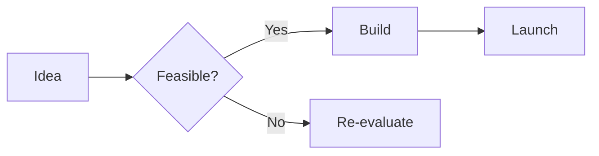

---
layout: cover
---

# Slidev Demo

A modern way to create presentations

Built with Vite + Vue + Markdown

---

# What is Slidev?

- **Web-based** presentation framework
- **Markdown** with extended syntax
- **Code highlighting** with Shiki
- **Animations** & interactive components
- **Export** to PDF, PPTX, or SPA

---

# Code with Line Highlighting

```ts {all|2|3-4|5}
function fibonacci(n: number): number {
  if (n <= 1) return n
  let a = 0, b = 1
  for (let i = 2; i <= n; i++)
    [a, b] = [b, a + b]
  return b
}
```

---

# Click Animations

<div v-click>1 — Appears on first click</div>
<div v-click="2">2 — Appears on second click</div>
<div v-click="3">3 — Appears on third click</div>

<v-click>

- Reveal entire blocks too!

</v-click>

---

# Two Column Layout

::left::

## Left Column

- Bullet A
- Bullet B
- Bullet C

::right::

## Right Column

- Bullet D
- Bullet E
- Bullet F

---

# Mermaid Diagram



---

# LaTeX Math

When $a \ne 0$, there are two solutions to $ax^2 + bx + c = 0$:

$$x = {-b \pm \sqrt{b^2-4ac} \over 2a}$$

---

# Tables

| Feature | Slidev | Marp | Google Slides |
|---------|--------|------|---------------|
| Animations | ✅ | ❌ | ✅ |
| Code highlight | ✅ | Basic | ❌ |
| Diagrams | ✅ | ❌ | ❌ |
| Offline | ✅ | ✅ | ❌ |
| Themes | 100+ | 3 | Limited |

---

# Monaco Editor

```ts {monaco}
import { ref, computed } from 'vue'

const count = ref(0)
const double = computed(() => count.value * 2)
```

---

# Drawing Mode

Press **C** during presentation to draw on slides.

Perfect for highlighting key points live.

---

layout: end
---

# Thank You

Try it yourself: `npx slidev slides.md`
